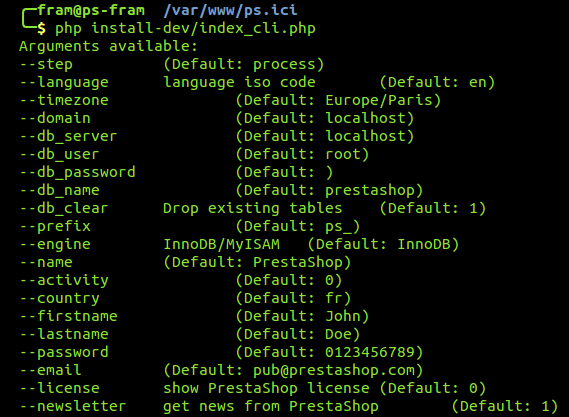

# Installer PrestaShop 1.7 en ligne de commande

## De quoi s’agit-il ? <a id="InstallerPrestaShop1.7enlignedecommande-Dequois&#x2019;agit-il?"></a>

Cet installateur spécial permet d’installer PrestaShop sans navigateur web : il suffit de placer le contenu de l’archive zip sur votre serveur web pour pouvoir installer PrestaShop via l’interface de ligne de commande \(ILC\). N’importe quel logiciel d’ILC peut être utilisé tant que vous pouvez l’utiliser pour interagir avec les commandes du serveur : Bash, Windows PowerShell, OS X Terminal, PuTTY, etc.

L’intérêt d’avoir un installateur sous forme d’ILC en plus de l’installateur habituel intégré au navigateur est d’offrir cette possibilité aux utilisateurs avancés qui préfèrent souvent des interfaces de ligne de commande car elles sont souvent un moyen plus concis et puissant de contrôler un programme ou un système d’exploitation.

## Mode d’emploi <a id="InstallerPrestaShop1.7enlignedecommande-Moded&#x2019;emploi"></a>

L’installateur ICL est facile d’utilisation : depuis votre terminal, accédez au dossier `/install` \(ou `/install-dev`\) \(ce qui implique d’avoir auparavant décompressé le fichier pestashop.zip\) et lancez le script avec cette commande :

```text
$ php index_cli.php
```

Cette opération affiche les différentes options disponibles.



Toutes les options de l’installateur intégré au navigateur sont disponibles, avec leur valeur par défaut répertoriée. Presque toutes les valeurs par défaut peuvent être laissées telles quelles car vous pouvez les modifier dans le back-office de PrestaShop une fois l’installation terminée. Notez que le courriel et le mot de passe sont ceux utilisés pour créer le compte de back-office de l’administrateur...

Pour lancer l’installation, il vous suffit de fournir un seul argument. En réalité, vous devez en fournir plus :

* **domain**. L’emplacement où vous voulez que votre boutique apparaisse.
* **db\_server**. L’adresse du serveur de base de données.
* **db\_name**. Le nom de la base de données que vous souhaitez utiliser.
* **db\_user**. L’utilisateur de la base de données que vous souhaitez utiliser.
* **db\_password**. Le mot de passe du nom d’utilisateur de base de données ci-dessus.

Par exemple :

```text
$ php index_cli.php --domain=exemple.com --db_server=sql.exemple.com --db_name=prestashop --db_user=root --db_password=123456789
```


Si vous définissez également la valeur `--email` pour qu’elle soit reliée à votre propre adresse, un courriel récapitulatif vous sera envoyé une fois l’installation terminée.

## Liste des arguments <a id="InstallerPrestaShop1.7enlignedecommande-Listedesarguments"></a>

Voici la liste des arguments pour index\_cli.php à compter de la version 1.6 :

| **Nom** | **Paramètre par défaut** | **Description** |
| :--- | :--- | :--- |
| --step | process |  |
| --language | en | code de langue iso |
| --timezone | localhost |  |
| --domain | localhost |  |
| --db\_server | localhost |  |
| --db\_user | root |  |
| --db\_password | \(blank\) |  |
| --db\_name | prestashop |  |
| --db\_clear | 1 \(true\) | Supprime les tables |
| --db\_create | 0 \(false\) | Crée la base de données si elle n’existe pas encore |
| --prefix | ps\_ |  |
| --engine | InnoDB | InnoDB/MyISAM |
| --name | PrestaShop | Nom de la boutique |
| --activity | 0 |  |
| --country | fr |  |
| --firstname | John |  |
| --lastname | Doe |  |
| --password | 0123456789 |  |
| --email | [pub@prestashop.com](mailto:pub@prestashop.com) |  |
| --license | 0 \(false\) | Affiche la licence de PrestaShop |
| --newsletter | 1 \(true\) | Abonne l’administrateur à la newsletter de PrestaShop |
| --send\_email | 1 \(true\) | Envoie un email à l’administrateur après l’installation |

