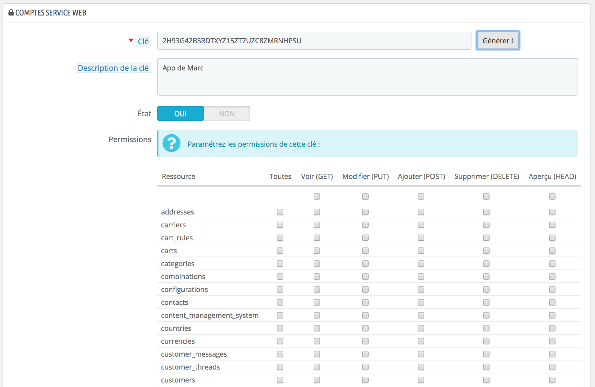

# Paramètres du service web

Sur cette page, vous pouvez activer le service Web de la boutique, afin que des outils tiers puissent avoir accès à vos données. Cela ouvre la porte à la création d'outils intéressants qui aideront vos clients ou vous-même à utiliser votre boutique plus efficacement \(par exemple, sous forme d'application mobile\).

Un service Web est une méthode de communication entre deux entités logicielles, au travers d'un réseau. Elle repose sur un jeu de méthodes, formats et droits d'accès connus, afin de pouvoir utiliser le contenu du service web à partir de n'importe quel outil autorisé, et étendre le contenu original. Pour en apprendre plus, lisez la page Wikipedia [http://fr.wikipedia.org/wiki/Service\_Web](http://fr.wikipedia.org/wiki/Service_Web).

La page s'ouvre avec une liste des clés actuellement en place, s'il y en a. Une clé de service Web offre un accès unique à votre base, que vous donnez à un développeur afin qu'il lie son outil à votre boutique. N'en créez pas des centaines, car vous pourriez ne pas souhaiter que tout le monde puisse accéder à vos données.

Toutes les applications ne peuvent pas accéder au service Web de PrestaShop : vous décidez qui le peut, et ce que chacune est autorisée à faire. Chaque application dispose d'une clé de connexion unique, avec des droits d'accès spécifiques.

## Ajouter une nouvelle clé 

Le bouton "Ajouter une clé de service web" vous emmène au formulaire de création :

* **Clé**. Une clé unique. Vous pouvez soit en créer une vous-même, soit en générer une, par exemple à l'aide du bouton "Générer !" ou en utilisant un générateur en ligne. Les clés générées sont la plupart du temps plus sûres, car plus difficiles à deviner.
* **Description de la clé**. Un rappel du destinataire de la clé, et des droits qu'elle donne.
* **Statut**. Vous pouvez désactiver une clé aussitôt que nécessaire. Cela vous permet de ne donner qu'un accès temporaire à vos données pour certaines clés.
* **Permissions**. Vous n'avez pas à partager TOUTES vos données avec chaque clé. Vous pouvez choisir parmi une grande quantité de permissions, soit par section, soit par type d'accès. Certaines applications n'auront ainsi que le droit de lire une poignée d'éléments, tandis que d'autres \(par exemple, celle que vous souhaitez utiliser pour gérer votre boutique à distance\) devront avoir le droit de modifier et effacer à peu près toutes les données. Par conséquent, nous vous recommandons de faire un choix éclairé.

## Configuration 

Pour des raisons de sécurité, assurez-vous que le serveur de votre boutique accepte les connexions SSL !

La configuration est assez simple :

* **Activer le service web**. Si vous voulez que personne n'accède à votre boutique par le biais d'outils et applications tiers, désactivez simplement cette fonctionnalité.
* **Activez le mode CGI de PHP**. Le mode CGI est un réglage particulier du serveur Apache, avec lequel vous indiquez qu'il doit utiliser PHP en mode de script CGI plutôt qu'en tant que module Apache. Bien que le mode CGI ait la réputation d'être plus sécurisé, des failles de sécurité y ont été découvertes en mai 2012. Demandez conseil à votre hébergeur.

Développeurs : la documentation sur le [service Web de PrestaShop](https://app.gitbook.com/@prestashop/s/prestashop-1-6-documentations/~/drafts/-MEhOG0w2JhftfYWyPdZ/english-documentation/developer-guide/developer-tutorials/using-the-prestashop-web-service) \(en anglais\) se trouve ici : [https://app.gitbook.com/@prestashop/s/prestashop-1-6-documentations/~/drafts/-MEhOG0w2JhftfYWyPdZ/english-documentation/developer-guide/developer-tutorials/using-the-prestashop-web-service](https://app.gitbook.com/@prestashop/s/prestashop-1-6-documentations/~/drafts/-MEhOG0w2JhftfYWyPdZ/english-documentation/developer-guide/developer-tutorials/using-the-prestashop-web-service)

