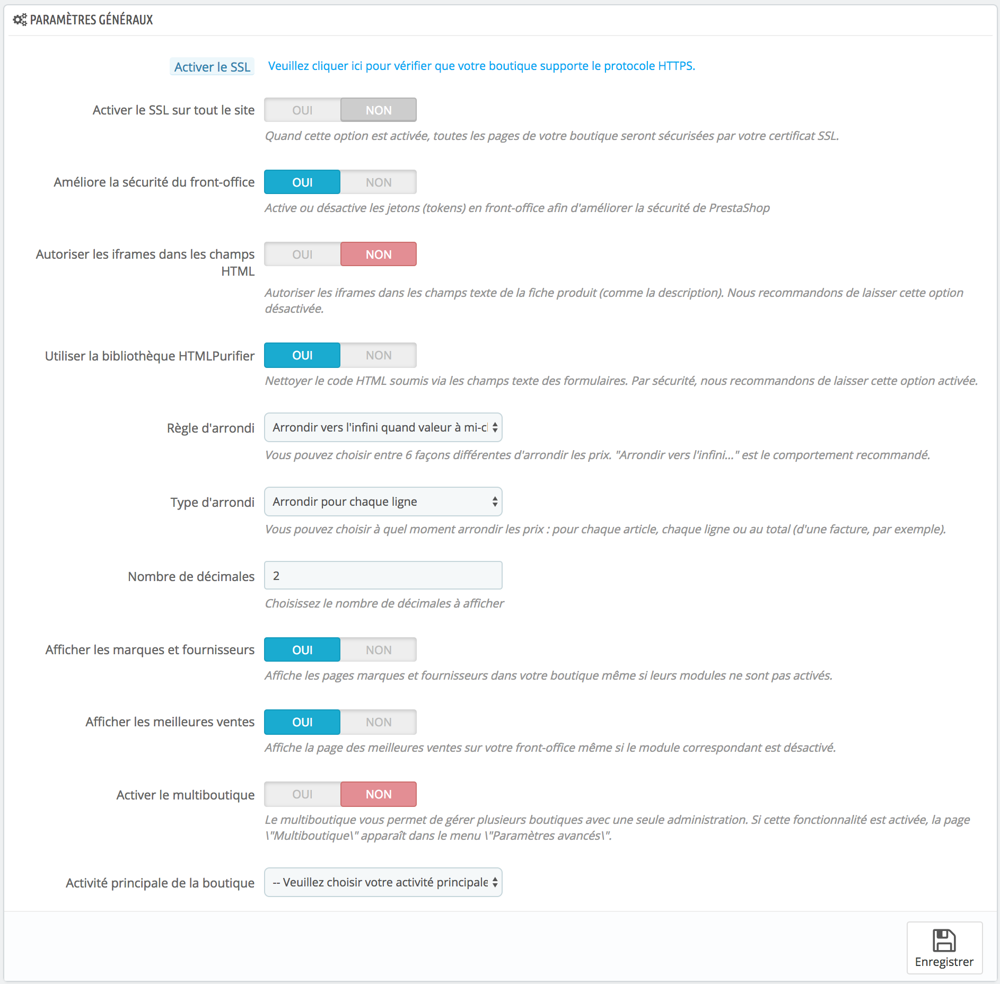

# Paramètres généraux

La page des préférences générales présente une poignée de réglages spécifiques qui ne peuvent être mis dans d'autres menus. Ils sont néanmoins essentiels :

* **Activer le SSL**. SSL signifie "Secure Sockets Layer", et comprend le TSL \(pour "Transport Layer Security"\). Les deux sont des protocoles Internet cryptographiques, qui sécurisent les échanges sur le Web. Vous pouvez en apprendre plus sur ces protocoles sur Wikipédia : [http://fr.wikipedia.org/wiki/Transport\_Layer\_Security](http://fr.wikipedia.org/wiki/Transport_Layer_Security). Le fait de fournir une connexion SSL pour votre boutique est non seulement une chose positive pour les échanges sur Internet, mais également un bon moyen de rassurer vos clients sur la sécurité de leurs données \(identifiants, carte de crédit, etc.\) sur votre boutique, car de nombreux navigateurs modernes indiquent visuellement que la connexion est sécurisée. Si votre hébergeur propose le protocole SSL, assurez-vous de l'activer dans PrestaShop en cliquant sur le lien. Cela affichera un sélecteur, dans lequel vous devrez choisir "Oui". Le SSL sera activé sur les pages du tunnel d'achat et du compte client.
* **Activer le SSL sur tout le site**. Cette option n'est disponible que si vous avez activé le SSL, via l'option juste au-dessus. Elle permet à toutes les pages de votre site d'être protégées via le certificat SSL \(et pas seulement les pages du tunnel d'achat et du compte client\).
* **Améliorer la sécurité du front-office**. Cette option ajoute des jetons de sécurité \(_tokens_\) à votre boutique afin d'en améliorer la sécurité. Dans les faits, chaque adresse devient spécifique à la session du client, et ne peut être utilisé telle quelle dans un autre navigateur, protégeant ainsi toutes les informations qui auraient pu être stockées durant cette session.
* **Autoriser les iframes sur les champs HTML**. Cette option vous permet de mettre des iframes dans les champs textuels, tels que les descriptions de produits. Les IFrames sont des éléments HTML qui permettent de charger du contenu externe dans le contenu propre de la page. Nous vous recommandons de laisser cette option désactivé, sauf en cas de besoin réel.
* **Utiliser la bibliothèque HTMLPurifier**. Vos clients peuvent envoyer des informations à votre boutique par le biais de champs textuels \(par exemple, les descriptions de produits ou les informations personnelles\), mais les pirates peuvent également envoyer du code nocif par ce biais afin d'essayer de hacker votre boutique. Cette option vous garantit que les données reçues sont sécurisées. Vous ne devriez la désactiver que si vous savez exactement ce que vous faites.
* **Règle d'arrondi**. Une fois les taxes et promotions appliquées, il se peut que le prix final aie trop de décimales, par exemple 42.333333333 €. La règle d'arrondi est utilisée sur l'ensemble des affichages de prix du front-office, ainsi que lors du calcul final du prix \(taxes, promotions, etc.\). En soi, la règle d'arrondi change peu de choses en restant à la décimale, mais l'impact est beaucoup plus fort lorsque le calcul de l'arrondi se fait sur le total de la facture, et doit prendre en compte de nombreux produits, des taxes et des promotions. Six modes sont disponibles :
  * **Arrondir vers l'infini quand valeur à mi-chemin**. C'est le mode recommandé. 42,55555555 devient 42,56.
  * **Arrondir vers zéro quand valeur à mi-chemin**. 42,55555555 devient 42,56.
  * **Arrondir au chiffre pair le plus proche \(arrondi bancaire\)**. 42,55555555 devient 42,56.
  * **Arrondir au chiffre impair le plus proche**. 42,55555555 devient 42,56.
  * **Arrondir à la valeur supérieure la plus proche**. 42,55555555 devient 42,56.
  * **Arrondir à la valeur inférieure la plus proche**. 42,55555555 devient 42,56.
* **Type d'arrondi**. Cette option vous permet de choisir le type d'arrondi, ce qui peut avoir un impact important sur le calcul du total de vos factures. Il y a trois types d'arrondi, par ordre progressif :
  * **Arrondir pour chaque article**. Le prix de chaque article sera arrondi avant le calcul du total. S'il y a plusieurs exemplaires d'un même article, chacun de ces exemplaires sera arrondi séparément avant le calcul total.
  * **Arrondir pour chaque ligne**. Le prix de chaque article sera arrondi avant le calcul du total. S'il y a plusieurs exemplaires d'un même article, l'arrondi sera fait sur l'addition des prix de ces exemplaires.
  * **Arrondir le total**. L'arrondi ne sera fait que lors du calcul final, après que les prix de tous les articles ont été additionnés.
* **Nombre de décimales**. Vous pouvez choisir le nombre de décimales pour les arrondis de prix. Par exemple, si vous choisissez "3", 42.333333333 sera affiché comme 42.334.
* **Afficher les fournisseurs et les marques**. Les blocs "Fournisseur" et "Marques" peuvent être enlevés du front-end de votre boutique, en désactivant leurs modules respectifs. Cela étant, à l'aide de cette option, vous pouvez toujours rendre leurs listes disponibles, notamment via les adresses `/manufacturer.php` et `/supplier.php`.
* **Afficher les meilleures ventes**. Le bloc "Meilleures ventes" peut être enlevé du front-office de votre boutique, en désactivant le module Bloc Meilleures Ventes. Cela étant, à l'aide de cette option, vous pouvez toujours rendre sa liste disponible par le biais de l'adresse `/top-sales.php`.
* **Activer le multiboutique**. Cette petite option a des implications majeures : elle transforme votre boutique unique en une installation multiboutique. Elle vous donne accès à la page "Multiboutique" du menu "Paramètres avancés", et toutes les pages de l'administration peuvent changer de contexte pour appliquer leurs réglages au choix à toutes les boutiques, à un groupe de boutiques, ou à une seule boutique. Vous pouvez en apprendre plus sur la fonctionnalité multiboutique de PrestaShop en lisant le chapitre "Gérer plusieurs boutiques" de ce guide.
* **Activité principale de la boutique**. Il se peut que vous ayez mal configuré l'activité de la boutique lors de l'installation. Vous pouvez changer ce paramètre ici.  

