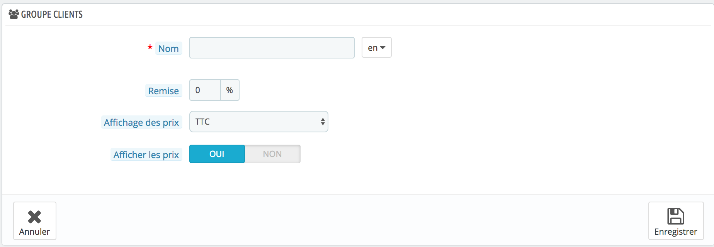
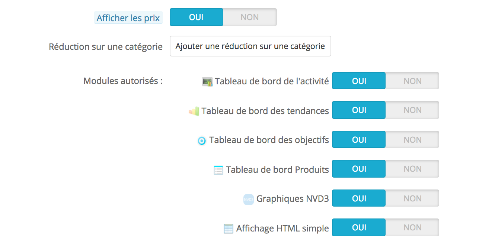

# Groupes de clients

PrestaShop vous donne la possibilité d'offrir certains privilèges à vos clients, en les assignant à des groupes. Vous pouvez créer autant de groupes de clients que vous le souhaitez, et leur assigner autant de clients que nécessaire.

Tout se passe dans l'onglet "Groupes" de la page de paramétrage "Clients".

Par défaut, trois groupes sont répertoriés :

* **Visiteur**. Tout utilisateur n'ayant pas de compte client ou n'étant pas identifié.
* **Invité**. Tout utilisateur qui a passé une commande à l'aide de la commande express \(guest checkout\) – il faut que cette option soit activée.
* **Client**. Tout utilisateur ayant créé un compte sur votre boutique, et s'étant identifié.

Ces trois groupes ne peuvent pas être supprimés.

Pour créer d'autres groupes, cliquez sur "Ajouter un groupe de clients", vous aurez alors accès au formulaire de création.

* **Nom**. Utilisez un nom court et descriptif.
* **Remise \(en %\)**. La réduction que vous souhaitez appliquer à tous les produits de votre boutique, pour les membres de ce groupe. Vous pourriez préférer ne pas mettre en place de réduction ici, et passer par des règles paniers.
* **Affichage des prix**. PrestaShop est souvent utilisé pour des boutiques de commerce interentreprises \(secteur B2B\). Vous pouvez créer un groupe de clients qui peuvent acheter des produits sans payer de taxes. La liste déroulante vous donne le choix entre "taxes incluses" et "taxes exclues".
* **Afficher les prix**. Par défaut, tous les utilisateurs d'une boutique peuvent voir vos prix. Vous pourriez préférer que certains membres ne puissent pas les voir. Par exemple, vous pouvez faire en sorte que seuls les membres connectés puissent voir les prix. Pour ce faire, vous devez modifier le groupe en question pour que l'option "Afficher les prix" soit sur "Non".

Une fois ces réglages en place, vous pouvez enregistrer le groupe tel-quel, ou ajouter un réglage par module ou par catégorie. Dans ce second cas, après que le groupe ait été enregistré, rouvrez-le : le formulaire se rechargera avec deux nouvelles options :

* **Réduction sur une catégorie**. Cliquez sur le bouton "Ajouter une réduction sur une catégorie" pour afficher une nouvelle fenêtre contenant une liste de toutes vos catégories. Vous pouvez en choisir une, et lui appliquer une réduction spécifique qui sera appliquée seulement à ce groupe de clients, et seulement pour cette catégorie. Notez que :
  * Seuls les produits ayant cette catégorie comme catégorie par défaut verront leurs prix affectés par la réduction. Les produits n'ayant cette catégorie que comme catégorie secondaire ne seront pas affectés.
  * La réduction de catégorie remplacera toute autre réduction à laquelle les membres de ce groupe pourraient avoir droit pour cette catégorie.
  * Vous pouvez ajouter autant de catégories que nécessaire à un groupe de clients – ce qui vous permet d'appliquer à ce groupe un jeu totalement différent de réductions en comparaison avec les autres clients, si besoin est.
* **Modules autorisés**. Cette section vous permet de bloquer l'accès à certains modules pour les membres de ce groupe. Par exemple, vous pourriez préférer que certains clients ne puissent pas voir vos meilleures ventes ou vos promotions du moment.

Vous pouvez ajouter un client à un groupe de votre choix en modifiant les informations du client : depuis la liste des clients \(page "Clients" du menu "Clients"\), cliquez sur l'icône "Modifier" dans la ligne du client, dans le tableau "Accès de groupe", sélectionnez le groupe auquel vous souhaitez que votre client appartienne. Si vous lui assignez plusieurs groupes, prenez soin d'indiquer son groupe principal avec l'option "Groupe de clients par défaut".

