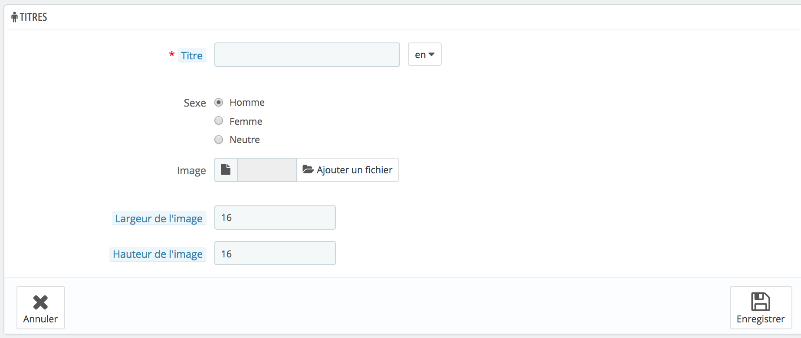

# Titres de civilité

L'outil de gestion des titres de civilité vous permet de mieux définir vos clients : dans la liste des clients, vous pouvez choisir de n'afficher que les clients ayant un titre de civilité donné. Les modules peuvent également exploiter cette fonctionnalité pour offrir certaines fonctionnalités.

En cliquant sur le bouton "Ajouter un titre de civilité", vous ouvrez le formulaire de création :

* **Nom**. Vous pouvez choisir ce que vous voulez, depuis le très habituel \("Monseigneur", "Dame", "Gentilhomme"\) au très inhabituel \("Maître Jedi", "Grand ordonnateur", "Chef de famille"\). Quand vous sortez des titres habituels, il est important de faire en sorte de renvoyer une certaine image de votre boutique.
* **Type**. Certains noms s'appliquent aux hommes comme aux femmes, ou à aucun des deux. Dans ces cas, choisissez "Neutre".
* **Image**. Un fichier en 16\*16 représentant le titre. Les symboles genrés habituels sont Mars et Vénus \(**♂** et **♀**\), mais il y a de nombreuses autres possibilités. PrestaShop vous permet de mieux caractériser votre création à l'aide d'une image unique.
* **Largeur de l'image** et **Hauteur de l'image**. PrestaShop travaille mieux avec des images en 16\*16, et redimensionnera votre image si elle dépasse cette limite. Cependant, vous voudrez peut-être utiliser des images plus grandes, et ces deux options vous permettent de régler la taille exacte de votre image. Si vous saisissez "0", PrestaShop utilisera simplement la taille initiale de l'image.

