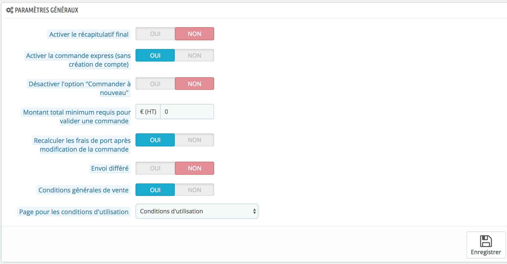

# Préférences des commandes

Les réglages de la page de préférences "Commandes" s'appliquent aux commandes faites par les clients, ainsi que quelques autres détails, comme la gestion des cadeaux.

## Préférences générales 

* **Afficher le récapitulatif final.** Certaines législations exigent d'afficher un récapitulatif de la commande \(panier, adresse, méthode de livraison, etc.\) avant le bouton de confirmation finale. Cette option vous permet de choisir de l'afficher ou non.
* **Type de processus de commande**. Par défaut, le client doit parcourir 5 étapes pour venir à bout du processus d'achat, chacune sur une page différente. Cependant, vous pouvez choisir d'afficher toutes ces étapes sur une seule page. Cette page sera plus longue, mais certains clients peuvent préférer cette approche.
* **Activer la commande express**. Autorise les visiteurs non-enregistrés à faire une commande, sans devoir créer de compte.
* **Montant total minimum requis pour valider une commande**. Indique le montant minimum d'achat à avoir dans son panier pour pouvoir lancer une commande. Si la valeur du champ n'est pas atteinte, le client ne peut pas passer commande. Si vous ne voulez pas de montant minimal, saisissez "0".
* **Recalculer les frais de port après modification de la commande**. _Nouveau en 1.7_. Permet de recalculer automatiquement les frais de port quand vous avez modifié une commande \(ajouté un produit, modifier l'adresse de livraison, etc.\). Cette option permet également de pouvoir changer le transporteur pour une commande qui n'a pas encore été confirmée \(et de recalculer les frais de ports en conséquence\).
* **Envoi différé**. Si vous activez l'option "Autoriser la commande de produits hors stock" \(page de paramètres "Produits"\), vous pouvez faire en sorte que les produits soient expédiés au fur et à mesure qu'ils sont disponibles, avec autant de colis que nécessaire \(selon le bon jugement de votre équipe\). Par défaut, PrestaShop divisera la commande en deux : les produits disponibles sont envoyés aussitôt, tandis que les autres sont placés dans une seconde commande, en attente de validation.
* **Conditions générales de vente**. Oblige vos clients à accepter les conditions de vente de votre boutique avant de valider la commande.
* **Page pour les conditions d'utilisation**. Le texte des conditions de vente de votre boutique doit être placé dans une page de contenu statique \("Apparence &gt; Pages"\). Sélectionnez la page en question afin que PrestaShop donne le bon lien à vos clients.

## Options des emballages cadeaux 

* **Proposer des emballages cadeaux**. Fait en sorte que PrestaShop propose un emballage cadeau au client, et donne la possibilité d'ajouter un message imprimé. C'est une option essentielle pour les personnes qui veulent envoyer des cadeaux depuis votre site.
* **Tarifs emballages cadeaux**. Indiquez le prix de votre service d'emballage.
* **Taxe des emballages cadeaux**. Au besoin, indiquez la taxe locale à laquelle ce service est lié. Vous pouvez ajouter de nouvelles taxes depuis la page "Taxes" du menu "International".
* **Proposer des emballages recyclés**. De nombreux clients apprécient ce type de service.

