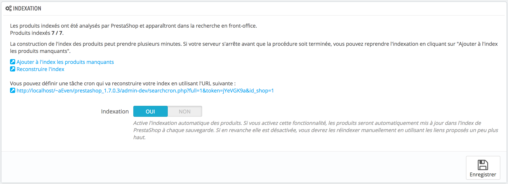
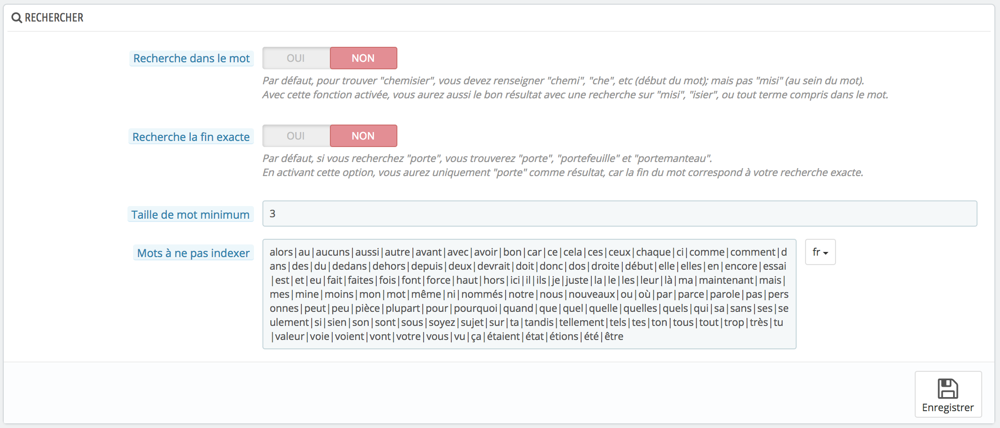
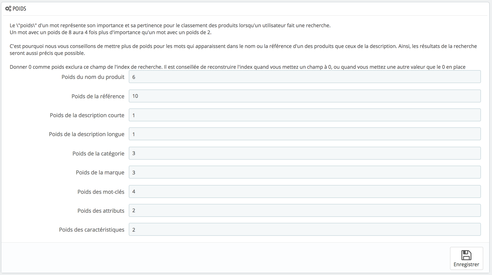

# Préférences de recherche

La page "Recherche" vous permet de configurer les fonctionnalités de recherche de votre boutique.

## Liste d'alias 

Quand vos clients lancent une requête sur le moteur de recherche interne de votre boutique, ils peuvent faire des erreurs. Si PrestaShop n'affiche pas les bons résultats, la fonctionnalité "alias" peut s'en occuper. Vous êtes ici en mesure d'enregistrer des mots contenant des erreurs de syntaxe, et de les faire pointer vers les bons produits.

Pour créer un nouvel alias utile, vous devriez d'abord trouver les erreurs de vos clients les plus courantes :

1. Rendez-vous sur l'onglet "Recherches de la boutique" de la page "Statistiques", dans le menu du même nom. Vous pouvez y découvrir les mots saisis par vos clients, dont les plus fréquentes erreurs.
2. Prenez les plus fréquentes, et ajoutez-les à votre liste d'alias, afin de les faire pointer vers les bons produits.
3. Cliquez sur le bouton "Ajouter un alias" de la page de préférence "Recherche".

Le formulaire de création est très simple : indiquez l'erreur que vous voulez voir corrigée, et le mot correct qui y correspond.

Par exemple, supposons que vos visiteurs utilisent fréquemment "letceur" ou "lecture" plutôt que "lecteur". Vous pouvez créer un alias pour chacune de ces erreurs, et leur faire correspondre "lecteur". Les alias sont en place dès qu'ils sont enregistrés.

Nous vous invitons également à consulter la section de ce guide sur les balises méta de produits et de catégories, afin de mieux comprendre comment afficher des produits en fonction des mots saisis par le client.

## Indexation 

Cette section fournit des informations sur le nombre de produits qui sont accessibles au moteur de recherche interne à votre boutique, et les compare au nombre de produits présents dans la base de données. Si les valeurs ne correspondent pas, vous devez sélectionner l'option "Ajouter à l'index les produits manquant". Seuls les nouveaux produits seront indexés.

Si vous avez fait de nombreuses modifications à des produits déjà indexés, vous pourriez préférer reconstruire l'intégralité de votre index. Le processus "Reconstruire l'index" prend plus de temps, mais il est exhaustif.

PrestaShop vous donne également une adresse afin de créer une tâche cron permettant de régulièrement reconstruire votre index. Si vous ne savez pas ce que qu'est une tâche cron ou un crontab, contactez votre hébergeur.

## Options de recherche 

Cette section vous permet de configurer le comportement du moteur de recherche interne à votre boutique :

* **Rechercher dans le mot**. Cette option améliore la recherche en permettant d'afficher des résultats qui ne correspondent pas uniquement au début d'un mot, mais aussi à l'intérieur du mot. Par exemple, une recherche "mis" donnera comme résultat "chemise".
* **Rechercher la fin exacte**. Avec cette option, vous pouvez donner des résultats qui correspondront exactement à la fin d'un mot. Par exemple, si vous cherchez "feuille", vous aurez "millefeuille", "portefeuille", mais pas "feuilleton". Cela peut être utile pour permettre de trouver facilement des références par exemple.
* **Taille de mot minimum**. Vous pouvez choisir le nombre de caractères minimal à partir duquel un mot est enregistré dans l'index de recherche, et donc peut être trouvé par vos clients. Cette fonctionnalité vous permet d'éliminer les mots courts de la recherche, tels que les prépositions ou les articles \(le, et, de, etc.\).
* **Mots à ne pas indexer**. Vous pouvez choisir les mots qui ne doivent pas être trouvables pour vos clients. Saisissez-les directement dans le champ, séparés par "\|".

## Poids 

PrestaShop vous permet de prioriser certaines données quand une recherche est lancée sur votre boutique.

Comme indiqué dans cette section, le "poids" d'un mot représente son importance et sa pertinence pour le classement des produits lorsqu'un client lance une nouvelle recherche.  
Un élément disposant d'un poids égal à 8 aura 4 fois plus de valeur qu'un élément au poids égal à 2.

Par exemple, par défaut "Poids du nom du produit" est à 6, "Poids des tags" est à 4, et "Poids de la description courte" ainsi que "Poids de la description longue" sont à 1. Cela signifie qu'un produit avec "ipod" dans son nom apparaîtra plus haut dans les résultats de recherche qu'un autre produit n'ayant "ipod" que dans ses tags. De son côté, un produit n'ayant "ipod" que dans l'une de ses descriptions aura le classement le plus bas des résultats.

De nombreux facteurs peuvent ainsi se voir assigner un poids : description courte, catégorie, tags, attributs, etc. Vous vous rendrez compte que les résultats peuvent être inversés simplement en changeant le poids de certains champs. L'affinement de ces réglages sera surtout visible sur les catalogues ayant de nombreuses références.

Vos changements sont pris en compte dès qu'ils sont enregistrés.

