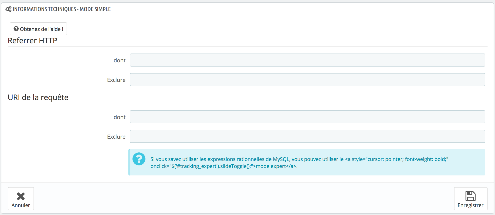
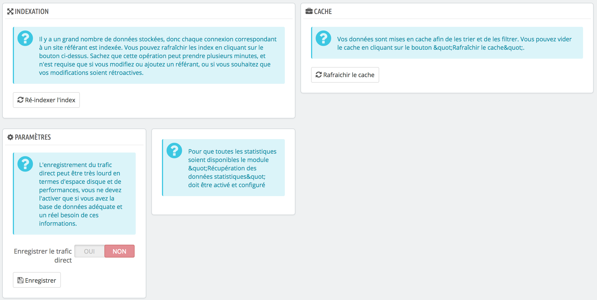

# Affiliation

Un site référant est un site qui vous amène au moins un visiteur. Ce site présente un lien vers votre boutique, et donc vous aide à vous construire un public et au final à faire plus de ventes.

Certains sites référants sont plus importants que d'autres : vous pourriez avoir des affiliés qui mettent en place des liens vers votre site sur le leur, et ce partenaire \(et vous-même\) voudrait certainement savoir combien de visiteurs ce lien vous amène. Vous pourriez même rémunérer vos partenaires pour la mise en place de ce lien, en fonction de la manière dont vous estimez votre trafic.  
Dans les faits, on appelle cela "faire de l'affiliation", et la page "Affiliés" vous aidera à construire un véritable programme de partenariat, auquel même votre partenaire pourra se connecter pour voir le nombre de visites et de ventes que leur lien a généré. Les partenaires enregistrés génèrent du trafic vers votre boutique, vous voulez les remercier pour ces visiteurs, et le programme d'affiliation est l'outil que vous utiliserez pour voir les chiffres sur lesquels cette rémunération est basée.

L'outil d'affiliation de PrestaShop peut être comparé à un tableau de bord statistique ouvert à d'autres membres que votre équipe. Lorsque vous créez une campagne d'affiliation pour un site, vous pouvez accorder à ce site un accès à toute l'activité qu'il aura généré sur votre boutique par le biais de ce lien, au moyen d'une adresse protégée par mot de passe : [http://example.com/modules/trackingfront/stats.php](http://example.com/modules/trackingfront/stats.php).

Dans la liste des affiliés, les valeurs de Clics, Base et Pourcentage sont calculées en fonction des clics, ventes en pourcentages de vente réels du site affilié.

## Ajouter un nouveau site affilié 

L'espace d'affiliation vous permet de créer un accès privilégié pour vos partenaires. Ils auront accès à toutes les statistiques sur le flux de visiteurs en provenance de leur site. Pour leur créer cet espace privilégié, vous devez leur créer un compte dans votre programme d'affiliation, puis définir la manière dont vous allez les rémunérer en fonction du trafic et des ventes générées.

Pour créer un nouveau partenaire affilié, cliquez sur le bouton "Ajouter un affilié", qui vous amène au formulaire de création.

Chaque section est importante :

* **Affilié**. Le compte de votre partenaire dans le programme d'affiliation.
  * **Nom**. Pour se connecter à votre back-office d'affiliation, votre partenaire a besoin d'un identifiant ; vous pouvez utiliser un simple nom ou une adresse e-mail, mais faites en sorte d'utiliser un identifiant dont vous comme votre partenaire pourrez vous souvenir facilement.
  * **Mot de passe**. La première fois que vous créez le compte, PrestaShop enregistre le mot de passe en même temps que l'identifiant. Lorsque vous voudrez modifier le compte \(par exemple, lorsque vous souhaitez changer la valeur d'une commission\), le champ du mot de passe sera blanc. Cela ne signifie pas qu'il n'y a pas de mot de passe enregistré ; si vous mettez un nouveau mot de passe dans le champ vide, il remplacera celui qui était enregistré.
* **Commission**. C'est ici que vous indiquez la rémunération de votre affilié – c'est à dire l'argent que vous devrez à votre partenaire en fonction des actions des visiteurs venant de leur site.
  * **Coût par clic**. Vous définissez ici la valeur d'un visiteur en provenance du site du partenaire. Chaque fois qu'un visiteur vient du site de votre partenaire, le partenaire gagne le montant indiqué.
  * **Rémunération de base**. Vous pouvez également récompenser vos partenaires si les visiteurs en provenance de leur site achètent vos produits. Notez que cela ne compte que si l'achat se fait dans la session de navigation suivant le clic sur le lien du partenaire.
  * **Rémunération en %**. En plus de la rémunération de base, ou en remplacement de celle-ci, vous pouvez récompenser les partenaires avec un pourcentage des ventes faites sur la session de navigation suivant le clic sur leur lien.
* **Informations techniques - Mode simple**. C'est extrêmement important, car c'est ce champ qui fera en sorte que le système fera la différence entre un partenaire et un autre site affluent. Une fois configuré, vous devriez faire plusieurs tests pour vous assurer que vous suivez correctement l'affilié.
  * **Référant HTTP**. Dans le champ "Inclure", configurez le nom de domaine que vous voulez suivre pour cet affilié.
  * **URI de requête**. Dans le champ "Inclure", configurez la dernière partie de l'adresse cliquée. Le système suivra les sites affluents qui ont une requête spéciale dans leur adresse. Par exemple, vous pouvez suivre les sites affluents qui ont `?prestaff=` en argument de leur URL. Cela vous aidera d'autant plus à différencier les affiliés.
* **Informations techniques - Mode expert**. Tandis que le mode simple fait correspondre vos champs à l'aide de la fonction "LIKE" de MySQL, le mode expert utilise des expressions régulièrement. Cela peut certes se montrer beaucoup plus puissant, mais également beaucoup plus complexe à maintenir. N'utilisez ces champs que si vous êtes vous-même un expert en expressions régulières.

La section "Aide" vous donne de précieuses indications sur la meilleure manière de configurer un affilié. Lisez-la attentivement.

## Configuration 

Les réglages des sites affluents sont surtout des outils pour vous aider à mieux gérer votre programme d'affiliés.

Vous avez trois possibilités :

* **Enregistrer le trafic direct**. Le trafic direct correspond aux visiteurs qui arrivent sur votre boutique directement, en saisissant l'adresse de votre boutique dans leur navigateur. Bien que ces visiteurs soient importants, car ils connaissent vraiment votre boutique et sont intéressés pas vos produits \(au contraire des visiteurs en provenance de liens affiliés, qui ne savent pas forcément sur quelle boutique ils vont tomber\), enregistrer ce trafic peut se montrer être un poids excessif sur votre base de données. C'est pourquoi par défaut, ce trafic n'est ni enregistré, ni analysé. N'activez cette option que si vous savez ce que vous faites.
* **Indexation**. Vous devez cliquer une fois sur le bouton "Ré-indéxer l'index" lorsque vous ajoutez un nouvel affilié et que vous voulez analysez votre trafic passé en fonction de celui-ci.
* **Cache**. PrestaShop met en cache les données qu'il récupère. Vous pouvez utiliser le bouton "Rafraîchir le cache" pour régulièrement rafraîchir vos données.

