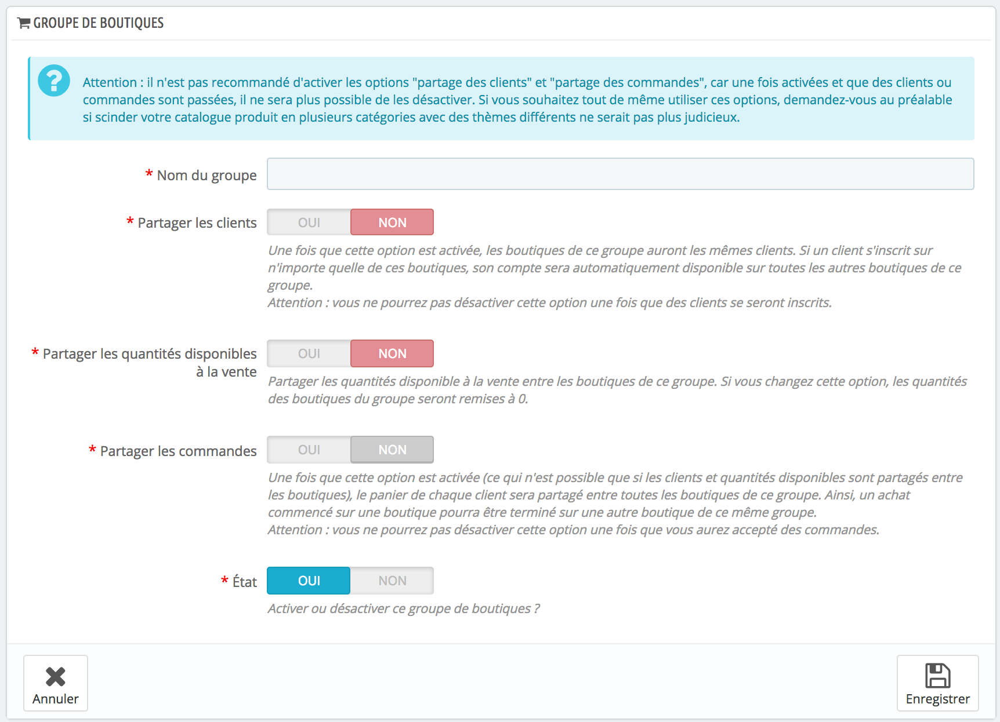

# Créer un groupe de boutiques

Le fait d'avoir un groupe de boutiques vous permet de partager certaines caractéristiques entre les boutiques de ce groupe : catalogue, employés, transporteurs, modules, etc. Cela vous permet de gérer un ensemble de boutiques aussi facilement que si vous gériez une boutique seule, tout en pouvant régler plus finement les détails de chaque boutique à la main. Ainsi, il ne vous faudra qu'une action pour appliquer de nouveaux paramètres à toutes les boutiques d'un groupe. En mode multiboutique, un menu déroulant est disponible en haut de la plupart des pages de l'administration, et vous permet de filtrer vos modifications par boutique ou groupe de boutiques.

Techniquement, lorsque vous sélectionnez un groupe de boutiques dans le menu déroulant, les entités affichées présentent **l'union** des entités rattachées aux boutiques dans ce groupe.

Plus généralement, les paramètres sont appliqués à toutes les entités appartenant à l'entité choisie avec le menu déroulant multiboutique. Tout ceci est expliqué en détail dans ce chapitre.

En cliquant sur le bouton "Ajouter un nouveau groupe de boutiques" ouvre un formulaire avec peu d'options mais beaucoup de texte : assurez-vous de lire chaque description du début à la fin, car elles vous aideront à prendre les bonnes décisions pour ces options. Étant donné que certaines sont irréversibles \(vous ne pouvez pas les désactiver après les avoir activées\), il vous faut absolument comprendre ce qu'elles activent.

Les réglages disponibles sont :

* **Nom du groupe**. Le nom reste privé, et les clients ne le verront pas. Cependant, faites en sorte d'utiliser un nom explicite : plus vous aurez de groupe de boutiques, plus aurez besoin de les discerner rapidement. Vous pouvez changer le nom à tout moment.
* **Partager les clients**. _Une fois activée, vous ne pouvez pas désactiver cette option_. Très utile quand vous souhaitez autoriser vos clients à utiliser les même identifiants sur toutes les boutiques de ce groupe de boutiques.
* **Partager les quantités disponibles à la vente**. Vous pouvez avoir différentes quantités disponibles pour un même produit en fonction de la boutique. Avec cette option, toutes les boutiques de ce groupe partageront la même quantité disponible de produit. Cela vous facilitera grandement la gestion de ces quantités.
* **Partager les commandes**. _Une fois activée, vous ne pouvez pas désactiver cette option_. Cette option ne peut être activée que si les options "Partager les clients" et "Partager les quantités disponible à la vente" sont toutes les deux activées. Avec cette option, les clients qui sont connectés à n'importe quelle boutique de ce groupe pourront accéder à leur historique de commande pour toutes les boutiques du groupe.
* **État**. Choisissez d'activer ce groupe maintenant ou plus tard. Vous pouvez activer/désactiver un groupe à n'importe quel moment.  

Deux groupes de boutiques ne peuvent pas partager les clients, paniers et commandes.

Les groupes de boutiques existants peuvent être modifiés de la liste des groupes de boutiques sur la page d'accueil "multiboutique" : pour ouvrir le formulaire de modification, cliquez simplement sur l'icône "modifier" à droite de la ligne de la boutique. Comme indiqué, vous ne pouvez pas modifier les options "Partager les clients" et "Partager les quantités disponible à la vente".

