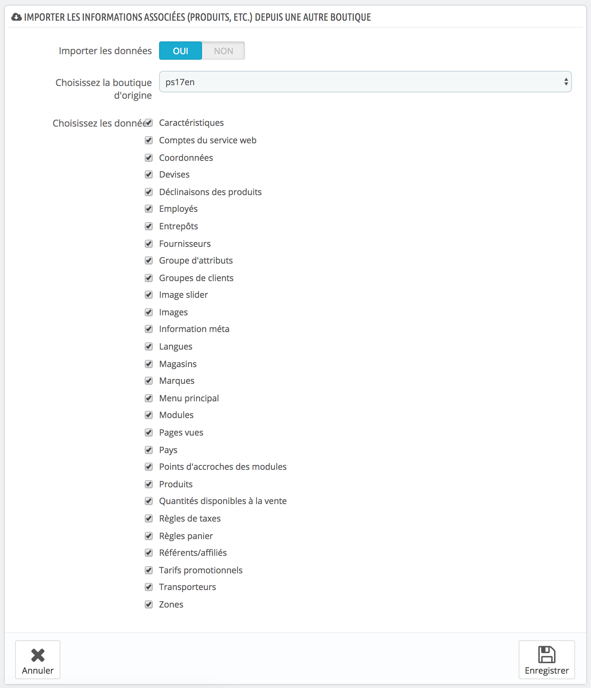

# Créer une boutique

L'outil de création de boutique, situé sur la page "Multiboutique", vous permet de définir simplement et précisément à la fois l'apparence front-office de votre boutique \(en l'occurrence, son thème\) et les éléments que vous voulez y importer depuis votre boutique principale.

En cliquant sur le bouton "Ajouter une nouvelle boutique", un formulaire s'ouvre avec deux sections. La première a 5 options :

* **Nom de la boutique**. Le nom est public : les clients le verront en de nombreux endroits, tels que le titre du site ou les références e-mail. Faites en sorte qu'il corresponde bien à la boutique en question.
* **Groupe de boutiques**. Une boutique ne peut appartenir qu'à un seul groupe de boutique. De même, elle **doit** appartenir à un groupe : elle ne peut pas exister en dehors d'un groupe de boutiques – même si elle est seule dans ce groupe. Note : vous ne pourrez pas déplacer une boutique dans un autre groupe si vous le créez dans un groupe de boutiques ayant l'une de ses trois options activées \("Partager les clients", "Partager les quantités disponible à la vente" ou "Partager les commandes"\).
* **Catégorie parente**. Bien que votre boutique principale à la racine de son catalogue comme catégorie racine, les autres boutiques peuvent utiliser soit la même racine, soit une autre catégorie du catalogue en tant que racine – dans les faits, en utilisant un sous-ensemble du catalogue principal comme son propre catalogue.
* **Catégories associées**. En plus de pouvoir limiter le catalogue d'une boutique à un sous-ensemble du catalogue principal \(voir l'option "Catégorie parente" ci-dessus\), vous pouvez choisir de ne rendre disponible pour cette boutique que certaines sous-catégories de la catégorie principale.
* **Thème**. Vous pouvez utiliser n'importe lequel des thèmes disponibles comme thème de cette boutique. Dans les faits, cela vous permet d'avoir le même catalogue disponible dans deux boutiques complètement différentes, avec thèmes, adresses et prix différents.

La seconde section, "Importer les informations associées \(produits, etc.\) depuis une autre boutique", vous permet de préciser les données de la boutique principale que vous voulez utiliser au sein de cette boutique.

Elle dispose de deux options :

* **Importer les données**. Si cette option est désactivée, votre boutique ne partagera aucune donnée avec d'autres boutiques, et la section se fermera d'elle-même. Bien qu'il puisse s'avérer utile de gérer deux boutiques totalement différentes avec une seule installation de PrestaShop, cela signifie également que vous devrez configurer les deux boutiques de A à Z, là où le partage de données vous permet de ne pas recréer des transporteurs, des devises ou des configurations de modules, par exemple. Réfléchissez bien à votre choix, car vous ne pourrez pas revenir en arrière.
* **Choisissez la boutique d'origine**. Si vous souhaitez effectivement importer des données, vous devez indiquer la boutique de laquelle ces données doivent provenir. Si vous avez déjà défini une sous-boutique de la boutique principale, cela peut vous aider à faire une "copie" de cette sous-boutique, au lieu de devoir configurer à nouveau les diverses options d'import.
* **Choisissez les données**. C'est ici que vous choisissez les types de données que vous souhaitez importer de la boutique source. Vous devriez au minimum importer tous les modules, même si cela signifie en désactiver certains, car l'intégralité du front-office est affichée à l'aide de modules, ainsi que certaines sections majeures du front-office. 

Lorsque vous créez un produit dans une nouvelle boutique, et que le produit existe déjà dans une autre boutique, PrestaShop essayera de suggérer un produit existant, afin de ne pas devoir tout recréer.

Au moment d'enregistrer la boutique, PrestaShop vous préviendra qu'elle n'a pas déjà d'URL. Cliquez sur l'avertissement rouge pour en ajouter un \(voir ci-dessous\).

