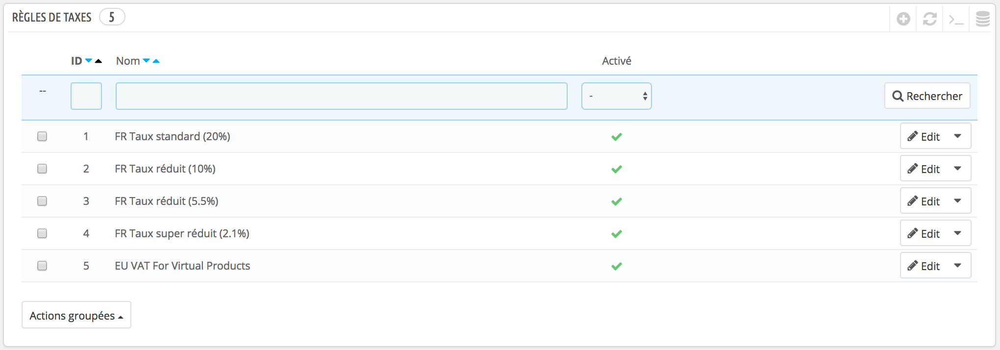
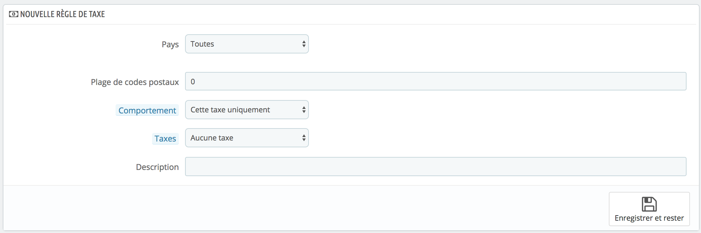

# Règles de taxes

Une règle de taxe vous permet de n'appliquer une taxe qu'à un ensemble donné de pays.

Par défaut, PrestaShop applique une taxe à tous les pays/états/zones. Si vous souhaitez qu'une taxe ne s'applique qu'à un pays ou à une sélection de pays \(en en excluant d'autres\), vous devez créer une règle de taxe. Cette règle de taxe est ensuite appliquée produit par produit, au moment où vous les créez \(onglet "Prix"\).

Vous ne pouvez pas directement appliquer une taxe à un produit ; vous ne pouvez lui appliquer que des règles de taxe. De fait, vous devez d'abord enregistrer toutes les taxes, puis pour chaque taxe créer la règle de taxe qui précisera le pays auquel cette taxe s'applique, et enfin appliquer cette règle de taxe au produit.

Quelques taxes d'exemple sont déjà en place, en fonction du pays que vous avez choisi lors de l'installation de PrestaShop. Ces règles sont en place pour chaque taxe : elles servent de filtre de pays, en limitant l'utilisation de la taxe à un ensemble donné de pays.

Vous devriez ouvrir les règles en place pour mieux comprendre comment les règles de taxe sont créées.

## Ajouter une nouvelle règle de taxe 

Vous pouvez ajouter autant de règles de taxe que nécessaire. Vous devriez même vous assurer que toutes les règles de taxe utiles sont enregistrées dans votre boutique.

La création d'une nouvelle règle de taxe se fait en deux étapes :

1. Créez la règle de taxe :
   * Cliquez sur le bouton "Ajouter un groupe de règles de taxes",
   * Dans le formulaire qui s'ouvre, nommez la règle. Utilisez un nom parlant : utilisez le code du pays de la taxe, son nom, peut-être même son taux, afin de vous aider à la retrouver facilement. Si PrestaShop a déjà des règles de taxe pour le pays cible, prenez leurs noms comme inspiration afin de conserver une certaine cohérence.    
   * Sélectionnez si la règle doit être activée dès qu'elle est créée ou non. Au besoin, vous pourrez l'activer plus tard.
   * Cliquez sur le bouton "Enregistrer et rester". La page se recharge, avec un en-tête de tableau en bas.  
2. Spécifiez le pays et les comportements :
   * Cliquez le bouton "Ajouter un nouvelle règle de taxe". 
     * Un nouveau formulaire apparaît. Remplissez ses champs :    
     * **Pays**. Le pays cible de la règle que vous créez.
       * _État/région._ Certains pays ont des états fédéraux enregistrés dans PrestaShop \(voir la page "États" du menu "Localisation"\). Dans ce cas, vous pouvez préciser encore plus la cible de la taxe, ou choisir de l'appliquer au pays entier. Vous pouvez sélectionner plus d'un état en laissant la touche Ctrl enfoncée lorsque vous cliquez sur des noms d'états.
     * **Plage de codes postaux**. Que le pays dispose d'états enregistrés ou non, vous pouvez préciser plus encore l'application de la taxe en utilisant le code postal du client. Ce champ vous permet de définir les codes postaux auxquels la taxe doit être appliquée : saisissez soit un code postal complet, soit une plage de codes postaux en utilisant un tiret. Par exemple, utilisez "75000-75012" pour une plage comprenant tous les codes postaux entre ceux-ci.
     * **Comportement**. Certains clients peuvent avoir une adresse qui correspond à plusieurs de vos règles de taxes. Dans ce cas, vous pouvez choisir comment cette taxe doit être appliquée :
       * _Cette taxe uniquement._ Seule cette taxe sera appliquée, et aucune des autres taxes correspondant au client.
       * _Combiner les taxes._ Combiner les taxes entre elles. Par exemple, 100€ + \(10% + 5% =&gt; 15%\) =&gt; 115€.
       * _L'une après l'autre._ Applique les taxes les unes après les autres. Par exemple, 100€ + 10% =&gt; 110€ + 5% =&gt; 115,50€.
     * **Taxe**. La taxe à utiliser pour cette règle de taxe. Cette taxe doit déjà exister dans PrestaShop. Si ce n'est pas le cas, choisissez "Aucune taxe", désactivez la règle de taxe, puis allez créer une taxe dans la page "Taxes" avant de revenir terminer cette règle de taxe.
     * **Description**. Vous pouvez ajouter une courte explication détaillant pourquoi cette règle existe pour ce pays.
   * Cliquez sur le bouton "Enregistrer et rester". Le pays sera ajouté au tableau en bas de la page, et vous pouvez ajouter un autre pays à l'aide des champs désormais vides.

Notez que le taux par défaut appliqué à vos produits sera basé sur le taux par défaut de votre pays.

