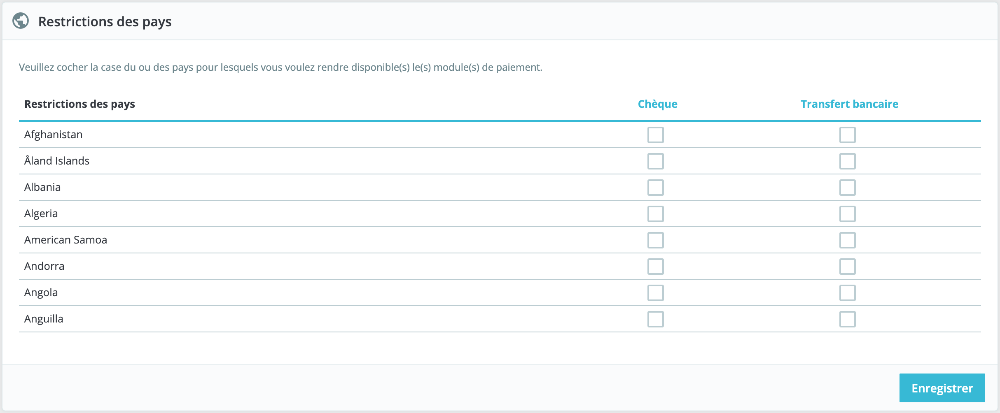

# Préférences de paiement

Les préférences de paiement vous permettent de définir quel mode de paiement doit être proposé à vos clients en fonction de la devise, du pays, du groupe client ou du transporteur utilisé. Prenez soin de bien paramétrer ces options, si vous souhaitez éviter les mauvaises surprises avec vos paiements !

## Restrictions des modules de paiement par rapport aux devises 

En fonction de la méthode de paiement, les options proposées à un client peuvent changer. Vous pouvez limiter le choix des méthodes de paiement disponibles en fonction des devises disponibles : vous pourriez préférer que les clients puissent payer avec n'importe quelle devise avec PayPal, mais que ceux utilisant Skrill ne puissent utiliser que le dollar, par exemple.

Ajouter une devise

Par défaut, une devise est disponible pour votre boutique. S'il vous en faut plus, suivez ce processus :

1. Dans la page "Localisation" du menu "International", importer le pack de localisation du pays utilisant la devise qui vous intéresse. Par exemple, les États-Unis pour le dollar américain, le Royaume-Uni pour la Livre Sterling, etc.
2. Dans l'onglet "Devises" de la page "Localisation", activer les devises que vous venez d'importer.

Si vous avez besoin de restreindre l'usage d'un module en fonction de la devise d'un utilisateur, cochez simplement les cases qui s'appliquent à votre cas et cliquez sur "Enregistrer les restrictions". Comme vous pouvez le constater, en fonction de la méthode de paiement, le choix de devises pour le client va différer :

* Pour certains, comme Paiement à la livraison, vous ne pouvez pas changer les réglages par défaut.
* Pour d'autres, comme Virement bancaire, Paiement par chèque, Skrill, Ogone, etc., vous pouvez changer tous les réglages, sauf "Devise du client" et "Devise par défaut de la boutique", qui reste dans leur état par défaut.
* Enfin, pour d'autres modules comme Hipay ou Paypal, vous pouvez changer tous les réglages, mais vous ne pouvez choisir qu'une option entre "Devise du client" et "Devise par défaut de la boutique", pas les deux à la fois.

Le client peut configurer sa devise à l'aide du menu déroulant au haut de chaque page du front office. Vous pouvez configurer la devise par défaut de la boutique depuis la page "Localisation", dans le menu "International".

Si vous modifiez la devise par défaut après avoir configuré vos premiers produits, vous devrez remettre en place les prix de tous les produits. Vous devez vous décider sur la devise par défaut avant de créer les premiers produits.

## Restrictions des modules de paiement par rapport aux groupes 

Vous pouvez limiter le choix des modules de paiement en fonction de certains groupes de clients.

Par exemple, disons que vous préférez que les clients non-professionnels payent par PayPal, Skrill et Hipay, et que les professionnels ne payent que par virement bancaire. En fonction du type de client et de vos choix, les clients ne pourront payer qu'avec les méthodes de paiement que vous avez choisies pour eux.

## Restrictions des modules de paiement par rapport aux pays 

Vous pouvez limiter le choix des méthodes de paiement en fonction du pays d'origine de votre client. Par exemple vous pouvez décider qu'en France, en Espagne et en Allemagne, vous acceptez toutes les méthodes de paiement ; tandis qu'en Italie, au Royaume-Uni ou en Suisse, les clients ne pourront payer que par virement bancaire.

Le tableau liste tous les pays connus. S'il en manque un, vous pouvez l'ajouter en passant par l'onglet "Pays" de la page "Zones géographiques".

Ici encore, tout comme la restriction par devise, les options disponibles varient en fonction du module de paiement :

* Pour certains, vous ne pouvez choisir que votre propre pays.
* Pour d'autres, vous ne pouvez choisir que les pays reconnus par le service : Autriche, Belgique, France, etc.
* Tous les autres modules de paiement par défaut devraient marcher avec tous les pays.

Trouvez le pays que vous recherchez dans la liste alphabétique, puis cochez les cases pour sélectionner ou non les méthodes de paiement que vous souhaitez rendre disponibles aux clients du pays en question. Une fois que tous les paramètres seront configurés, cliquez sur le bouton "Enregistrer", situé en bas de la page. Par défaut, tous les modules de paiement installés sont configurés pour le pays de la boutique.

## Restrictions des modules de paiement par rapport aux transporteurs 

Vous pouvez limiter le choix des méthodes de paiement en fonction de certains transporteurs.

