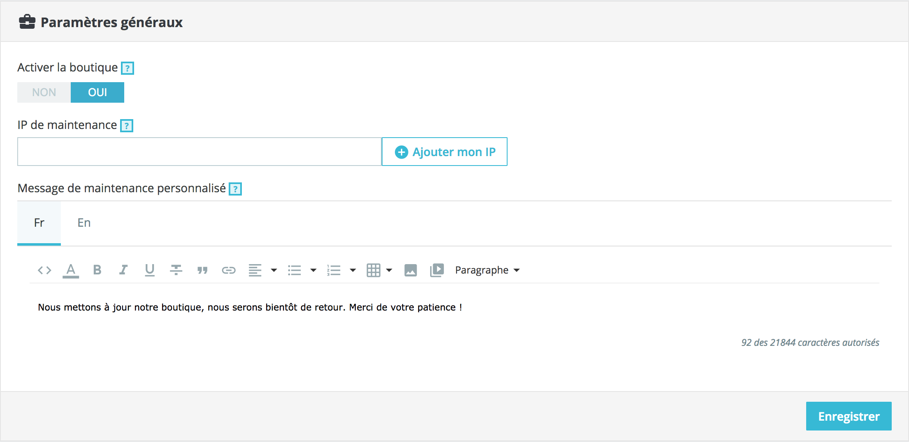
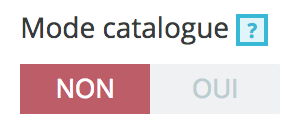
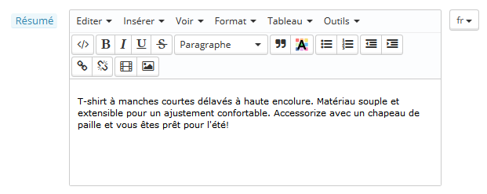
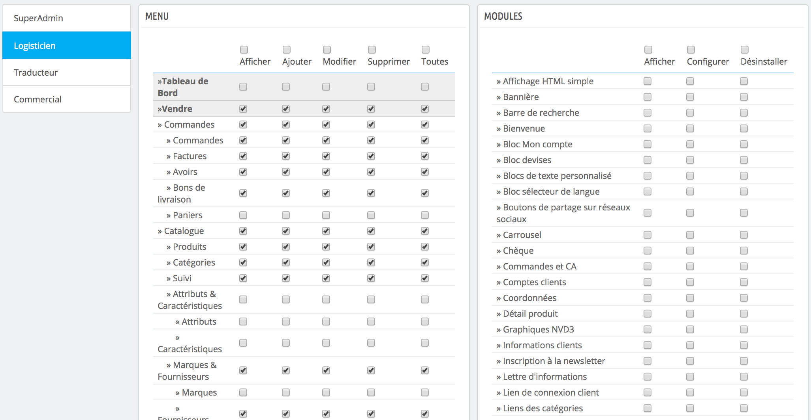

# Premiers pas avec PrestaShop 1.7

**Contenu**

* [Premiers pas avec PrestaShop 1.7](premiers-pas-avec-prestashop-1.7.md#PremierspasavecPrestaShop1.7-PremierspasavecPrestaShop1.7)
  * [Désactiver votre boutique](premiers-pas-avec-prestashop-1.7.md#desactiver-votre-boutique)
  * [Effacer le contenu de la boutique par défaut](premiers-pas-avec-prestashop-1.7.md#effacer-le-contenu-de-la-boutique-par-defaut)
  * [Configurer les informations de votre boutique](premiers-pas-avec-prestashop-1.7.md#PremierspasavecPrestaShop1.7-Configurerlesinformationsdevotreboutique)
    * [Réglages de base de la boutique](premiers-pas-avec-prestashop-1.7.md#reglages-de-base-de-la-boutique)
    * [Langues de la boutique](premiers-pas-avec-prestashop-1.7.md#PremierspasavecPrestaShop1.7-Languesdelaboutique)
    * [Informations sur les employés](premiers-pas-avec-prestashop-1.7.md#informations-sur-les-employes)
  * [Configurer les méthodes de paiement](premiers-pas-avec-prestashop-1.7.md#configurer-les-methodes-de-paiement)
  * [Configurer le transport](premiers-pas-avec-prestashop-1.7.md#PremierspasavecPrestaShop1.7-Configurerletransport)
  * [Choisir votre thème](premiers-pas-avec-prestashop-1.7.md#choisir-votre-theme)
  * [Choisir vos modules](premiers-pas-avec-prestashop-1.7.md#choisir-vos-modules)
  * [Créer des produits et des catégories de produits](premiers-pas-avec-prestashop-1.7.md#creer-des-produits-et-des-categories-de-produits)
  * [Créer du contenu statique](premiers-pas-avec-prestashop-1.7.md#creer-du-contenu-statique)
  * [Construire votre menu](premiers-pas-avec-prestashop-1.7.md#PremierspasavecPrestaShop1.7-Construirevotremenu)
  * [Activez votre boutique](premiers-pas-avec-prestashop-1.7.md#PremierspasavecPrestaShop1.7-Activezvotreboutique)

## Premiers pas avec PrestaShop 1.7 

Il vous faut prendre le temps de vous assurer que toutes les fonctionnalités de votre future boutique sont bien en place, validées et prêtes à prendre vos premières commandes.

PrestaShop facilite grandement la création d'une boutique en ligne, mais pas au point de pouvoir se mettre à vendre des produits dès les premières minutes suivant l'installation : ici, vous avez affaire à des produits, des clients, et surtout à un réel échange de devises, qui devront circuler de vos clients vers votre compte bancaire. De toute évidence, vous préféreriez qu'aucune faille ne vienne empêcher les transactions d'être validées, les produits d'être trouvés dans votre entrepôt et envoyés à vos clients sans erreur, ou même que quoi que ce soit d'inattendu n'arrive sans que vous ne soyez tenu au courant.

PrestaShop est un outil très complet, et l'étendue des possibilités peut sembler écrasante. Nous avons créé ce chapitre afin de vous aider à réaliser les principales actions à mettre en place pour préparer votre boutique à son grand lancement. Beaucoup de choses peuvent être faites avant l'ouverture des ventes, mais ces étapes sont essentielles pour n'importe quel type de boutique.

### Désactiver votre boutique

Nous allons partir du principe que vous venez tout juste d'installer PrestaShop, et comptez l'utiliser en mode monoboutique.

Désactiver votre boutique signifie que vous serez le seul à y avoir accès tout du long de votre mise en place du site : changer le thème, installer des modules, ajouter des produits et régler leurs prix et les taxes, configurer des transporteurs... Cette opération s'appelle "la mise en maintenance de la boutique."

Dans votre back-office, rendez-vous dans la page "Paramètres de la boutique / Général". Vous trouverez la maintenance sur le deuxième onglet. Cette page contient trois réglages :

* **Activer la boutique**. Choisissez "Non", et l'accueil de votre site affichera la page de maintenance à vos visiteurs, qui indique simplement que votre site sera bientôt de retour.
* **IP de maintenance**. C'est ici que vous devez saisir votre propre adresse IP, afin de toujours pouvoir accéder à votre boutique et parcourir les pages, pour vérifier que tout est bien en place. Cette option doit être remplie à chaque fois que vous mettez votre boutique en mode de maintenance, étant donné que vous aurez toujours besoin de vos pages publiques pour vérifier que tout es bien en place.
* **Message de maintenance personnalisé**. Nouveau en 1.7. Vous pouvez afficher le message de votre choix sur la page de maintenance, pour informer vos visiteurs \(pour indiquer par exemple quand votre boutique sera de nouveau disponible\).

Si vous avez déjà mis en place votre thème et vos produits, vous pouvez simplement passer votre boutique en mode Catalogue. Ainsi, vos visiteurs pourront parcourir les pages de votre boutique, mais aucun prix ne sera affiché, et ils ne pourront rien acheter tant que vous ne serez pas sorti du mode Catalogue.

Pour activer le mode Catalogue, rendez-vous dans la page "Paramètres de la boutique / Produits", dont c'est le premier réglage.

### Effacer le contenu de la boutique par défaut

L'installation par défaut de PrestaShop comprend une poignée de produits, pour la plupart des produits Apple accompagné d'accessoires tiers. Leur seul intérêt est de vous permettre d'explorer et comprendre la mise en place d'une boutique fonctionnelle. Après avoir appris les subtilités des liens entre produits, catégories, commandes et clients, vous devriez effacer tout ce contenu initial afin de partir d'une base saine et propre.

Vous devez donc effacer toutes les données par défaut, c'est à dire :

* les produits et leurs...
  * catégories
  * attributs
  * caractéristiques
  * marques
  * fournisseurs
  * scènes
  * tags
* les commandes
  * les messages liés aux commandes
* les clients
  * leurs paniers
* les transporteurs
  * les tranches de prix
  * les tranches de poids
* Les infos de contact et les magasins \(à effacer ou à adapter aux besoins de la boutique\)
* les pages de contenu statique \(à effacer ou à adapter aux besoins de la boutique\)

Cela supposerait que vous ayez à parcourir les nombreux écrans du back-office et supprimer votre contenu sur chaque écran, mais il y a une méthode bien plus facile :

1. Allez dans la page "Modules &gt; Modules",
2. Trouvez le module "Nettoyage de la base de données" \(PrestaShop Cleaner\) et cliquez sur son bouton "Installation",
3. Vous êtes immédiatement envoyé sur sa page de configuration \(si ce n'est pas le cas, cliquez sur son bouton "Configuration"\),
4. Lisez et acceptez l'avertissement, puis cliquez sur le bouton "Effacer le catalogue" : il supprimera tous vos produits et vos attributs, vos fabricants, etc.
5. Lisez et acceptez l'avertissement, puis cliquez sur le bouton "Effacer les commandes et clients" : il supprimera toutes vos clients et leurs commandes, paniers, etc.
6. Cliquez sur le bouton "Vérifier et corriger" pour rétablir les contraintes d'intégrité de votre base de données,
7. Cliquez sur le bouton "Nettoyer et optimiser" pour réorganiser le stockage physique des données de vos tables et les index de données associées, afin de réduire l'espace de stockage et améliorer l'efficace de lecture/écriture lors de l'accès aux tables.

VOS MODIFICATIONS SONT DÉFINITIVES. Assurez-vous de ne cliquez sur ces boutons que si vous souhaitez vraiment effacer le contenu par défaut de votre base de données.

### Configurer les informations de votre boutique 

Maintenant que vous disposez d'une boutique propre, vous pouvez commencer à en prendre possession, et cela implique de tout mettre à votre goût, à commencer par vos informations personnelles et vos préférences.

#### Réglages de base de la boutique

Vous devriez faire attention aux réglages suivants, qui sont importants car ils ont un impact direct sur le front-office, et donc que vos clients les voient.

Certains de ces réglages nécessitent que vous configuriez un module plutôt que de changer les préférences de PrestaShop.

Un module se configure très facilement :

1. Allez dans la page "Modules installés" du menu "Modules".
2. Saisissez le nom du module \(ou même une partie\) dans le moteur de recherche des modules. Les résultats devraient s'afficher dès que vous saisissez des lettres.
3. Une fois que vous avez trouvé le bon module, cliquez sur son bouton "Configurer", et suivez les instructions.

Pour chaque module présenté ici, vous devriez lire leur documentation pour avoir plus d'information.

<table>
  <thead>
    <tr>
      <th style="text-align:left">R&#xE9;glage</th>
      <th style="text-align:left">Description</th>
      <th style="text-align:left">Emplacement dans le back-office</th>
    </tr>
  </thead>
  <tbody>
    <tr>
      <td style="text-align:left">Nom de la boutique</td>
      <td style="text-align:left">D&#xE9;finit votre marque, notamment aupr&#xE8;s des moteurs de recherche.</td>
      <td
      style="text-align:left">Menu &quot;Param&#xE8;tres de la boutique&quot;, page &quot;Contact&quot;,
        onglet &quot;Coordonn&#xE9;es &amp; magasins&quot;, puis dans la section
        &quot;Coordonn&#xE9;es&quot;, modifiez le champ en question.</td>
    </tr>
    <tr>
      <td style="text-align:left">Logo de la boutique</td>
      <td style="text-align:left">D&#xE9;finit votre marque visuellement. Le logo par d&#xE9;faut est &quot;Classic&quot;,
        qui est le nom du th&#xE8;me par d&#xE9;fault, pour vous pousser &#xE0;
        utiliser le v&#xF4;tre.
         Affich&#xE9; en haut &#xE0; gauche de toutes les pages de la boutique,
        ainsi que sur vos factures et vos e-mails automatiques.</td>
      <td style="text-align:left">Menu &quot;Apparence&quot;, page &quot;Th&#xE8;me et logo&quot;, section
        &quot;Th&#xE8;me actuel&quot;, puis changez les diff&#xE9;rents logos.</td>
    </tr>
    <tr>
      <td style="text-align:left">Devise par d&#xE9;faut de la boutique</td>
      <td style="text-align:left">La monnaie dans laquelle vous allez saisir les prix par d&#xE9;faut de
        vos produits.</td>
      <td style="text-align:left">Menu &quot;International&quot;, page &quot;Localisation&quot;, section
        &quot;Configuration&quot;.
         Si la devise n&apos;est pas disponible, vous devez en premier lieu importer
        le pack de localisation de son pays : utilisez l&apos;outil &quot;Importer
        le pack de localisation&quot; de cette m&#xEA;me page.</td>
    </tr>
    <tr>
      <td style="text-align:left">Informations de contact</td>
      <td style="text-align:left">Plusieurs blocs pr&#xE9;sentant votre adresse de contact, le num&#xE9;ro
        de t&#xE9;l&#xE9;phone votre service client&#xE8;le et un lien permettant
        de vous envoyer un mail.
         Ils sont affich&#xE9;s &#xE0; plusieurs emplacement sur votre site.</td>
      <td
      style="text-align:left">
        
Les informations proviennent de la page &quot;Coordonn&#xE9;es et Magasin&quot;
          du menu &quot;Contact&quot; de la section &quot;Param&#xE8;tres de la boutique&quot;.

        
Pour d&#xE9;sactiver l&apos;affichage de ces informations, r&#xE9;ferrez-vous
          au module &quot;Coordonn&#xE9;es&quot;.

        </td>
    </tr>
    <tr>
      <td style="text-align:left">Carrousel d&apos;images (slider)</td>
      <td style="text-align:left">Le carrousel d&apos;image pr&#xE9;sente plusieurs images qui d&#xE9;filent
        l&apos;une apr&#xE8;s l&apos;autre. C&apos;est une signature visuelle forte
        de votre boutique et de vos produits.
         G&#xE9;n&#xE9;ralement plac&#xE9; au centre de la page d&apos;accueil.</td>
      <td
      style="text-align:left">Module &quot;Carrousel (slider)&quot;.</td>
    </tr>
    <tr>
      <td style="text-align:left">Pages</td>
      <td style="text-align:left">Il s&apos;agit des pages statiques, telles que les pages &quot;&#xC0;
        propos&quot;, &quot;Livraison&quot;, &quot;Mentions l&#xE9;gales&quot;,
        &quot;Conditions g&#xE9;n&#xE9;rales de vente&quot; et &quot;Paiement s&#xE9;curis&#xE9;&quot;.
        La plupart d&apos;entre elles ont un contenu par d&#xE9;faut, que vous
        devez adapter &#xE0; vos besoins ; d&apos;autres sont vides, et vous devez
        ajouter votre propre texte.
         Affich&#xE9;es dans la zone &quot;Informations&quot; du pied de page.</td>
      <td
      style="text-align:left">Menu &quot;Apparence&quot;, puis &quot;Pages&quot;. Vous pouvez modifier
        et cr&#xE9;er des pages selon vos besoin.</td>
    </tr>
    <tr>
      <td style="text-align:left">R&#xE9;seaux sociaux</td>
      <td style="text-align:left">Un bloc pr&#xE9;sentant trois liens pour suivre votre soci&#xE9;t&#xE9;
        sur les r&#xE9;seaux sociaux. Ils ne s&apos;affichent pas par d&#xE9;faut,
        il est donc important d&apos;indiquer les v&#xF4;tre via le module concern&#xE9;.
         Affich&#xE9;s dans la section &quot;Nous suivre&quot; du pied de page.</td>
      <td
      style="text-align:left">Module &quot;Liens de suivi pour r&#xE9;seaux sociaux&quot;.</td>
    </tr>
    <tr>
      <td style="text-align:left">Partage sur r&#xE9;seaux sociaux</td>
      <td style="text-align:left">Sur vos fiches produit, quatre boutons pour partager l&apos;URL de la
        page sur les r&#xE9;seaux sociaux : Facebook, Twitter, Google+ et Pinterest.</td>
      <td
      style="text-align:left">Module &quot;Boutons de partage sur r&#xE9;seaux sociaux&quot;.</td>
    </tr>
    <tr>
      <td style="text-align:left">R&#xE9;assurance</td>
      <td style="text-align:left">Sur votre site, et surtout sur la fiche produit, un bloc vous permet d&apos;afficher
        des &#xE9;l&#xE9;ments de r&#xE9;assurance. Utilisez le pour donner des
        indications sur votre politique de retours, votre politique de confidentialit&#xE9;
        ou sur les paiements s&#xE9;curis&#xE9;s, par exemple. Vos visiteurs seront
        plus en confiance avec ces informations.</td>
      <td style="text-align:left">Module &quot;R&#xE9;assurance&quot;.</td>
    </tr>
    <tr>
      <td style="text-align:left">Menu principal</td>
      <td style="text-align:left">Le haut du th&#xE8;me par d&#xE9;faut utilise un menu pour indiquer les
        cat&#xE9;gories que le visiteur peut parcourir, ainsi que des liens vers
        d&apos;autres adresses web.</td>
      <td style="text-align:left">Module &quot;Menu principal&quot;.</td>
    </tr>
    <tr>
      <td style="text-align:left">Contenu de la page d&apos;accueil</td>
      <td style="text-align:left">Le th&#xE8;me par d&#xE9;faut contient beaucoup de contenu d&apos;exemple
        : textes, images, liens, etc. Si vous souhaitez utiliser ce th&#xE8;me
        pour votre propre boutique au lieu d&apos;installer le v&#xF4;tre, vous
        devriez faire en sorte d&apos;enlever avant tout ce contenu par d&#xE9;faut.</td>
      <td
      style="text-align:left">
        
Module &quot;Banni&#xE8;re&quot; : modifie l&apos;image en bas de la page
          d&apos;accueil.

        
Module &quot;Blocs de texte personnalis&#xE9;&quot; : affiche le contenu
          de votre choix, en dessous de la banni&#xE8;re.

        
D&apos;autres modules disponibles dans les modules install&#xE9;s, section
          &quot;Modules de th&#xE8;me&quot;, vous aideront &#xE0; configurer votre
          boutique, passe-les tous en revue !

        </td>
    </tr>
    <tr>
      <td style="text-align:left">Conformit&#xE9; l&#xE9;gale</td>
      <td style="text-align:left">La l&#xE9;gislation Europ&#xE9;enne impose de fournir certaines informations
        &#xE0; vos clients, qu&apos;elles soient contractuelles ou l&#xE9;gales.
        Veuillez lire la page &quot;<a href="http://doc.prestashop.com/display/PS17/Complying+with+the+European+legislation">Complying with the European legislation</a>&quot;
        pour plus de d&#xE9;tails.</td>
      <td style="text-align:left">Le module &quot;Conformit&#xE9; l&#xE9;gal&quot; vous donne les moyens
        de mettre ces informations &#xE0; la disposition de vos clients, assurez-vous
        de bien les renseigner.</td>
    </tr>
  </tbody>
</table>

Ce sont là les modifications à faire qui sont les plus visibles sur votre front-office – au moins pour le thème par défaut.  
La colonne "Emplacement" vous permet de savoir où trouver l'interface permettant de modifier ces aspects de votre boutique. Ce guide de l'utilisateur vous donnera plus de détail sur chaque interface.

#### Langues de la boutique 

PrestaShop peut fonctionner dans de nombreuses langues, à la fois côté client et côté administration. Dès que plus d'une langue est activée dans le back-office, chaque champ textuel du back-office est accompagné d'un sélecteur de langue, qui indique la langue actuelle, et sur lequel vous pouvez cliquer pour insérer le contenu de ce champ dans une autre langue.

La page produit a un fonctionnement un peu différent. Vous ne trouverez pas un sélecteur de langue à côté de chaque champ, mais un sélecteur général pour tous les champs de la page, qui se situe en haut. Une fois une langue sélectionnée, vous pouvez modifier tous les contenus dans cette langue en même temps.

Par défaut, PrestaShop est installé avec deux langues : celle utilisée lors de l'installation, et celle rattachée au pays choisi pour votre boutique à l'installation \(s'il s'agit d'une autre langue\). Pour gérer les langues installées, rendez vous dans le menu "International", choisissez la page "Localisation" puis l'onglet "Langues". Celui-ci s'ouvre avec un tableau des langues disponibles.

La langue actuellement activée est indiqué avec une coche verte, tandis que les autres ont une croix rouge. Cliquez sur n'importe quelle de ces croix rouges pour activer la langue correspondante.

Vous pouvez activer toutes les langues disponibles si vous estimez que votre boutique en a besoin, mais gardez en mémoire que vous devrez traduire votre contenu pour toutes les langues disponibles : nom du produit, description, tags, nom de catégorie, contenu statique \(Pages\), réglages de modules, etc.

Vous pouvez facilement importer de nombreuses autres langues en passant par la page "Langues" du menu "International" \("Ajouter/modifier une langue"\), puis les activer en passant par la page "Localisation / Langues".

#### Informations sur les employés

Si des personnes vous aident à gérer votre boutique, qu'il s'agisse de votre conjoint, d'amis ou d'employés payés, il vous faut leur créer un compte personnel d'administration, ne serait-ce que pour savoir qui a lancé une action donnée \(prise de commande, par exemple\). L'autre avantage est que vous pouvez leur créer des profils précis, avec des droits d'accès précis pour les pages d'administration : par exemple, il se peut que vous préfériez limiter l'accès à vos statistiques, vos factures ou vos paiements.  
Vous pouvez créer autant de profils que nécessaire.

Pour créer un compte d'employé", allez dans le menu "Équipe" dans "Paramètres avancés", ouvrez la page "Employés", et cliquez sur le bouton "Ajouter un employé". Donnez-lui un nom, comme "Martin Dupont" ou "Responsable commandes", et enregistrez le compte.  
Un profil peut être utilisé par autant de comptes que nécessaires – mais nous vous recommandons d'en créer un par personne.

Maintenant que l'employé dispose d'un compte personnel, vous pouvez lui assigner un profil avec des permissions spécifiques, réservées aux activités de ce compte. Par défaut, un nouveau profil ne peut pas faire grand-chose. Il vous revient de faire les réglages précis qui correspondent aux besoins quotidiens de ce profil. Cela peut s'avérer laborieux, mais c'est nécessaire.  
Pour assigner des permissions à un compte d'employé, vous devez utiliser l'option "Profil" de la page de création du compte : ce menu vous permet de sélectionner le profil du compte \(SuperAdmin, Traducteur, etc.\).

Vous pouvez modifier les permissions d'un profil de la manière suivante : allez dans l'onglet "Permissions", et choisissez le profil que vous voulez modifier. Une longue liste de permissions apparaît alors : modifiez-les comme bon vous semble. Vos modifications sont enregistrées automatiquement.

### Configurer les méthodes de paiement

Vous ouvrez une boutique pour gagner de l'argent, et cela ne peut se faire que si vous utilisez au moins un module de paiement. 16 modules sont disponibles dans l'installation par défaut, que vous pouvez installer et configurer \(à partir de la catégorie "Modules installés" de la page "Modules"\), et leur créer des restrictions \(dans la page "Préférences" du menu "Paiement"\). Pour de nombreux modules, vous devrez créer un compte sur le service pour lequel ils ont été conçus.

Vous pouvez installer d'autres modules en les téléchargeant depuis le site Addons : [http://addons.prestashop.com/fr/4-modules-paiement-prestashop](http://addons.prestashop.com/fr/4-modules-paiement-prestashop).

Le paiement par chèque ou par virement bancaire sont les deux seules méthodes installées par défaut. Si vous choisissez de les conserver, vous **devez** les configurer avec vos informations : ordre du chèque et adresse où l'envoyer, détails bancaires \(compte, IBAN, BIC, etc.\).

Vous pouvez configurer ces deux méthodes de paiements en passant par les modules "Virement bancaire" et "Paiement par chèque", que vous trouverez la catégorie "Modules installés" de la liste de modules.

### Configurer le transport 

Les produits vendus sur votre boutique doivent être expédiés à vos clients – à moins que vous ne vendiez que des produits téléchargeables, auquel cas le menu "Transport" ne vous sera pas d'une grande utilité.

Que vous expédiez vos produits par courrier normal ou que vous disposiez d'un contrat chez un transporteur, vous devez enregistrer cette information dans PrestaShop.

Le chapitre "Gérer le transport" de ce guide vous apprendre tout ce qu'il y a à savoir sur ce menu.

Le retour marchandise n'est pas activé par défaut. Si vous voulez autoriser vos clients à vous renvoyer des produits et à recevoir un bon d'achat ou un remboursement en retour, vous devez activez l'option "Activer les retours" qui se trouve dans la page "Retours produits" du menu "Service client".

### Choisir votre thème

Votre boutique doit disposer de son propre thème pour se distinguer des autres et être reconnaissable au premier coup d'oeil. La dernière chose que vous voulez est que les visiteurs confondent votre boutique avec une autre.

Il y a des nombreux thèmes à acheter sur le site Addons : [http://addons.prestashop.com/fr/3-themes-prestashop](http://addons.prestashop.com/fr/3-themes-prestashop).

Vous pouvez également créer votre propre thème, ou le faire créer par un développeur. Pour savoir comment, rendez-vous sur le Guide de l'Intégrateur PrestaShop.

Une fois votre thème installé, vous devriez en parcourir toutes les pages afin de le connaître par coeur et de pouvoir aider les clients perdus.

Vous pouvez et même devez personnaliser certains aspects du thème, à commencer par le logo dans ses différentes variations \(en-tête, e-mail, facture, etc.\). Pour ce faire, rendez-vous sur la page "Thème & logo" du menu "Apparence".

### Choisir vos modules

L'installation par défaut de PrestaShop comprend une centaine de modules. Ils sont très variés : statistiques, bloc du front-office, paiement, expédition... Vous devriez les explorer pleinement, afin de voir lesquels vous souhaitez activer, et lesquels vous préférez garder désactivés.

Vous trouverez par ailleurs de nombreux modules sur le site Addons : [http://addons.prestashop.com/fr/2-modules-prestashop](http://addons.prestashop.com/fr/2-modules-prestashop).

Chaque fois que vous activez et configurez un module, assurez-vous qu'il fonctionne bien avec le thème que vous avez choisi, dans le cas où ses fonctionnalités ont un impact sur le front-office.

### Créer des produits et des catégories de produits

Lisez les chapitres "Gérer les produits" et "Gérer les catégories".

### Créer du contenu statique

Si vous ne l'avez pas déjà fait, prenez le temps d'écrire le contenu de quelques pages CMS, soit pour celles qui sont déjà disponibles dans l'installation par défaut, soit pour celles que vous estimez nécessaire de créer.

Certaines pages existent déjà, mais leur contenu doit être vérifié et revérifié, car ces pages peuvent avoir un impact fort sur le statut légal de votre boutique, entre autres choses.

Les pages par défaut sont "À propos", "Livraison", "Mentions légales", "Conditions d'utilisation", et "Paiement sécurisé". Certaines d'entre elles ont du contenu par défaut, que vous devez adapter à vos besoins ; les autres sont vides, et vous devriez y mettre du texte.  
Pour modifier ces pages, allez dans la page "Pages" du menu "Apparence", puis choisissez la page que vous voulez modifier, ou en créez-en de nouvelles.

Vous pouvez créer autant de pages que nécessaire.

### Construire votre menu

Maintenant que vous disposez de catégories de produit et de pages statiques, vous pouvez les ranger dans un ordre logique ou cohérent dans le menu de votre boutique.

Pour ce faire, vous devez passer par le menu "Menu principal", qui se trouve dans la catégorie "Modules de thème" de la liste de modules installés. Activez-le si ce n'est pas déjà le cas, puis configurez-le : enlevez les pages ou catégories qui ne vous semblent pas nécessaires, ajoutez-y d'autres pages, et déplacez le contenu jusqu'à être satisfait de votre menu.

### Activez votre boutique 

Maintenant que tout est fait, vous pouvez enfin lancer publiquement votre boutique.

Allez dans la page "Général" du menu "Paramètres de la boutique", et dans l'onglet "Maintenance", modifiez deux réglages :

* **Activer la boutique**. Remettez-le à "Oui".
* **IP de maintenance**. Retirez l'adresse IP. Cette modification est facultative : votre boutique marchera même si vous laissez votre IP dans le champ.

Votre boutique devrait maintenant être prête à accueillir ses premiers visiteurs... et prendre ses premières commandes !

