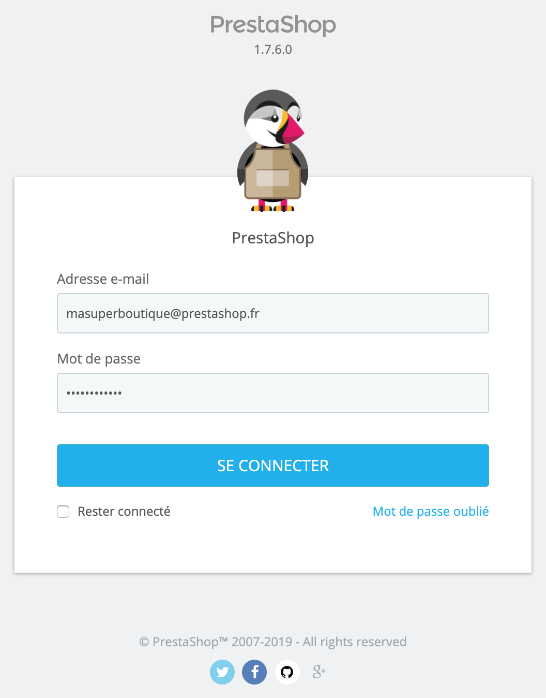
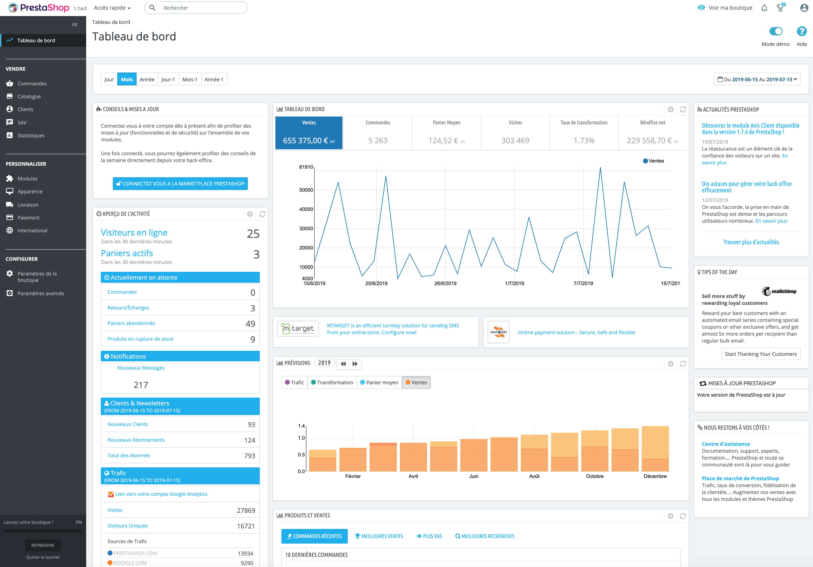

# Se connecter au back office de PrestaShop

Dans ce guide utilisateurs, nous utilisons "back office" pour désigner le panneau d'administration de votre installation de PrestaShop. Vous passerez la majeure partie de votre temps sur ce panneau, car tout ce qui est affiché pour l'utilisateur est géré directement depuis le back office : ajout/modification/retrait de produits, gestion des transporteurs, création de packs et de bons d'achat, gestion du SAV, amélioration de la boutique, etc.

Durant le processus d'installation, PrestaShop renomme le dossier d'administration, de `/admin` à un nom unique pour votre boutique \(par exemple, `/admin7809`\), ceci pour des raisons de sécurité. Utilisez ce nom de dossier pour accéder à votre back office, par exemple [http://www.monprestashop.com/admin7809](http://www.monprestashop.com/admin7809) .

Le changement de nom est fait automatiquement par PrestaShop. Faites attention à bien mémoriser le nom de ce dossier la première fois que vous accédez à l'administration !

Vous arriverez ainsi sur la page de connexion vers le panneau de contrôle de votre boutique.

Saisissez l'adresse e-mail et le mot de passe que vous avez choisi quand vous avez installé PrestaShop. Cliquez sur "Se connecter", et vous serez dirigé vers la page d'accueil du back office, véritable tableau de bord de votre boutique.

À partir de cette étape, vous pouvez commencer à configurer votre boutique et proposer des produits à vos clients.

Lisez le chapitre suivant de ce guide, "[Découvrir la zone d'administration](decouvrir-la-zone-dadministration.md)", pour comprendre les différentes sections du back office.

