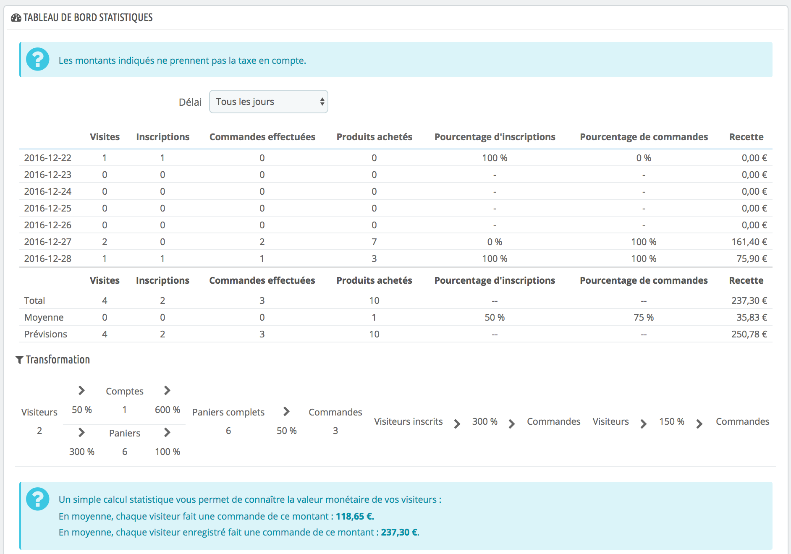
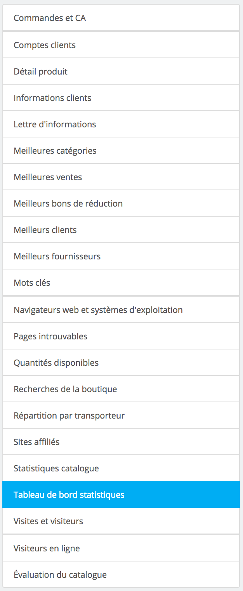

# Comprendre les statistiques

Au travers de cette section, nous allons comprendre l'utilité et le sens des différentes statistiques. En cliquant sur chacune des catégories dans la barre de navigation sur la gauche, la section centrale se recharge pour présenter les chiffres les plus récents.  
Pour la plupart des statistiques, une explication est donnée afin que vous puissiez comprendre les informations qui vous sont présentées, et en tirer profit pour améliorer la gestion de votre boutique et votre chiffre d'affaires.

Vidéo - 4 conseils pour optimiser les performances de votre boutique en ligne

 

## Interface principale 

Par défaut, la page affiche le tableau de bord des statistiques, un aperçu des principaux chiffres réunis par le système de statistiques de PrestaShop depuis le jour de lancement de votre boutique.

En haut de la page, une barre vous aide à choisir la période temporelle actuellement affichée. Trois jeux d'options sont disponibles :

* Ce jour, ce mois, cette année.
* Jour, mois ou année précédent\(e\).
* Une période précise \(date de début et date de fin\).

Cliquez sur "Enregistrer" pour afficher la période de votre choix.

Le tableau de bord contient 8 sections :

* Les statistiques principales. Voici réellement le coeur de vos statistiques. Dans un seul tableau, PrestaShop affiche un aperçu des chiffres les plus importants qui ont été réunis pendant la période de temps choisie : visiteurs, nombre d'inscriptions, nouvelles commandes, produits vendus, pourcentage d'inscription par visiteur, pourcentage de commandes par visiteurs, montant total combiné des ventes. Vous pouvez changer la granularité de ce tableau à l'aide de la liste déroulante en haut à droite de la section. Les périodes de temps disponibles sont Jour, Semaine, Mois et Année. Les trois lignes en bas du tableau ne sont pas affectées par le sélecteur de période : Total, Moyenne et Prévision vous permettent de mieux estimer la santé de votre boutique.
* **Conversion**. Cette section vous donne une idée de la valeur de chaque visiteur ou chaque client enregistré, en fonction du nombre de commandes qu'ils lancent, pour résumer. C'est ici encore un bon indicateur de la santé de votre boutique. Note : la différence entre "paniers" et "paniers complets" est qu'un panier correspond à une certaine sélection de produits d'un visiteur, tandis qu'un panier complet est un panier comprenant des produits ET une adresse de livraison ET un transporteur choisi – en somme, le panier a passé presque toutes les étapes du processus d'achat, et il ne reste plus au client qu'à payer.
* **Répartition par modes de paiement**. Cette section présente les méthodes de paiement le plus souvent choisies par vos clients. En fonction de ces chiffres, vous pourriez vouloir adapter votre boutique ou même votre société afin de mieux prendre en compte les méthodes les plus populaires, ou mettre en avant une méthode spécifique que vous préféreriez que vos clients utilisent. En utilisant le sélecteur "Zone" en haut à droite de la section, vous pouvez limiter les chiffres à une zone géographique spécifique, et donc voir quelle méthode marche le mieux ou le moins bien sur un marché donné.
* **Répartition par catégories**. Cette section donne des informations spécifiques en fonction de la catégorie. Pour chaque catégorie, elle présente des chiffres utiles : produits, ventes, pourcentage de produits de l'ensemble de votre catalogue, pourcentage de ventes sur l'ensemble de la boutique, prix moyen. Si vous notez qu'une catégorie est beaucoup plus populaire que d'autres, vous pourriez vouloir faire la promotion de celle-ci. D'un autre côté, vous pourriez vouloir améliorer les chiffres des catégories les plus décevantes en proposant des bons de réductions pour celles-ci, ou lancer d'autres actions promotionnelles. En utilisant le sélecteur "Zone" en haut de la section, vous pouvez limiter les chiffres à une zone géographique spécifique, et donc voir quelle catégorie marche le mieux ou le moins bien sur un marché donné.
* **Répartition par langues**. Vos clients peuvent choisir leur langue de navigation lorsqu'ils visitent votre boutique \(sous réserve que vous proposiez plusieurs langues\), et vous pouvez voir la répartition des langues grâce à cette section. Faites en sorte que tous vos produits soient correctement traduits dans au moins les deux langues les plus populaires.
* **Répartition par zones**. Vous pouvez filtrer les autres sections par zone géographique, et cette section vous donne directement un aperçu par zone de votre nombre de clients inscrits et des ventes réalisées \(et leurs pourcentages respectifs\).
* **Répartition par devises**. Si vous acceptez plus d'une devise, cette section vous aidera à voir laquelle est la plus utilisée par vos clients. En utilisant le sélecteur "Zone" en haut à droite de la section, vous pouvez limiter les chiffres à une zone géographique spécifique, et donc voir quelle devise marche le mieux ou le moins bien sur un marché donné.
* **Répartition des ventes par attributs**. Il s'agit plutôt ici d'une statistique interne, vous permettant de voir quels sont les attributs et groupes d'attributs les plus utilisés au sein de vos produits.

## Liste des statistiques disponibles 

La plupart des données statistiques peuvent être téléchargées sous forme de fichier CSV, en cliquant sur le bouton "Export CSV".

* **Commandes et CA**. Ces deux graphiques présentent l'évolution des ventes et commandes de votre boutique. Ils peuvent être filtrés par pays, en utilisant le menu-déroulant en haut à droite.
  * Le premier graphique indique le nombre total de commandes valides, et le nombre total de produits commandés. Avec ce graphique, vous pouvez déterminer sur quelles périodes vous avez reçu le plus de commandes.
  * Le deuxième graphique vous permet de visualiser vos ventes graphiquement. Il peut analyser les périodes où vous avez effectué les meilleurs résultats. Cela vous permettra de savoir quand mettre en place vos campagnes marketing.
* **Comptes clients**. Cette page propose un graphique avec le nombre de comptes utilisateurs créés dans votre boutique en ligne. Avec cette information, vous pouvez mesurer l'impact de vos campagnes marketing. Vous pouvez connaître le nombre de visiteurs qui se sont inscrits mais qui n'ont rien acheté. Vous pouvez aussi connaître le nombre d'utilisateurs qui ont créé un compte et acheté un produit immédiatement après.
* **Détail produit**. Cette page vous affiche tous les produits de votre boutique en fonction de leur référence, nom et stock. Vous pouvez trier les résultats en fonction des catégories que vous souhaitez traiter en sélectionnant à partir du menu déroulant au-dessus. Cliquez sur un produit pour accéder à ses statistiques. Vous verrez alors un graphique avec deux informations : le nombre de ventes et le nombre de visites sur la page du produit. Le taux de transformation sera également affiché.
* **Informations clients**. Cette section est divisée en 5 graphiques.
  * **Répartition par sexe**. Vous pouvez voir de quelle manière votre clientèle est distribuée en fonction des titres de civilité que vous avez configuré – par défaut, M. et Mme, mais il peut y en avoir de nombreux autres comme Dr. ou Sr. De fait, vous ne pouvez pas toujours prendre ce graphique au premier degré... à moins de n'avoir gardé qu'un minimum de titres de civilités, tous genrés.
  * **Tranches d'âges**. Vous pouvez voir de quelle manière votre clientèle est distribuée en fonction de l'âge, si vous demandez bien la date de naissance à l'inscription. Si vous constatez que la tranche d'âge de vos clients n'est pas celle que vous avez imaginée, il faudra peut-être réadapter votre approche marketing.
  * **Répartition par pays**. Vous pouvez voir rapidement dans quels pays vos clients vivent. Cela peut vous permettre de mieux cibler vos efforts marketing locaux.
  * **Tranches de devise**. Vous pouvez voir les devises utilisées dans votre boutique, et les proportions.
  * **Répartition par langue**. Vous pouvez voir les langues utilisées pour consulter votre site, et donc décider si vous devez ou non améliorer les traductions dans votre site.
* **Lettre d'information**. Cette page affiche les statistiques relatives aux souscriptions à la newsletter. Vous pouvez utiliser cette base de données pour garder vos clients informés. La newsletter contribue en général à l'augmentation du trafic sur votre site. Si vous souhaitez faire augmenter les souscriptions, vous pouvez par exemple proposer des bons de réduction avec la newsletter. Vous pouvez consulter l'adresse de tous les souscripteurs via le module "Inscription à la newsletter", dans la page "Module installés".
* **Meilleures catégories**. Cette section vous affiche les performances de votre boutique en fonction de vos catégories. Vous pouvez savoir pour chaque catégorie combien de produits ont été vendus, le revenu généré et le nombre de pages vues. Consultez régulièrement les résultats des différentes catégories afin d'améliorer la cohérence de votre boutique.
* **Meilleurs ventes**. Cette section affiche vos produits les plus performants. Vous aurez accès au chiffre d'affaires, aux ventes moyennes quotidiennes, au nombre de pages vues et à la quantité disponible en stock. Avec ce tableau, vous pouvez identifier vos produits phares et ainsi décider par exemple d'augmenter ou de réduire le prix, de proposer des réductions sur un produit spécifique.
* **Meilleurs bons de réduction**. Cette section résume l'utilisation des bons de réduction, promotions et règles de prix catalogue qui ont été distribués, que ce soit directement ou via une campagne promotionnelle. Ce tableau affiche aussi le chiffre d'affaires, et le nombre de bons utilisés.
* **Meilleurs clients**. Cette section vous indique quels sont les meilleurs clients de votre boutique. Leurs coordonnées sont affichées, ainsi que le nombre de fois qu'ils ont visité le site, le nombre de pages consultées, et combien ils ont dépensé. Gardez un œil sur cette page pour les suivre et prendre soin d'eux. En cliquant sur les boutons en haut des colonnes, vous pouvez choisir le mode d'affichage de ces informations.
* **Meilleurs fournisseurs**. Cette section propose des statistiques sur vos fournisseurs : elle affiche les quantités vendues et le revenu généré.
* **Mots-clés**. Cette page vous indique quels mots-clés dans les moteurs de recherche ont amené des visiteurs vers votre boutique. Cela vous permet de savoir quels termes vous rendent facilement identifiable. Inversement, vous saurez quels mots-clés sont absents de la liste et ne sont pas efficaces.
* **Navigateurs web et systèmes d'exploitation**. Cette section vous indique quels sont les navigateurs Web utilisés pour consulter votre site. Il est judicieux de vérifier que votre site est parfaitement compatible avec ces navigateurs, ou au moins les trois plus populaires. Vous pourrez aussi savoir si les clients utilisent Internet depuis leur mobile pour accéder au site. Si ce nombre de clients est important, il pourrait être intéressant de développer une version mobile de votre boutique. Enfin, vous serez en mesure d'analyser le système d'exploitation que vos clients utilisent. Assurez-vous que votre site est bien compatible avec toutes les plateformes utilisées par vos visiteurs.
* **Pages introuvables**. On vous indique ici les pages de votre catalogue qui n'ont pas été atteintes \(donnant une erreur "HTTP 404"\). C'est utile pour déceler des problèmes techniques potentiels qui seraient susceptibles d'amoindrir vos performances.
* **Quantités disponibles**. Cette section vous donne une idée de la valeur de votre stock.
* **Recherches de la boutique**. Cette section comprend deux indicateurs :
  * Le premier affiche la répartition des mots-clés qui ont été recherchés sur votre site. Vous pouvez ainsi savoir quels produits attirent le plus vos clients – et donc, ceux dont il vous faut impérativement avoir un large stock.
  * Le deuxième est un tableau résumant les recherches de vos clients. Vous pouvez ainsi voir quels mots-clés sont utilisés, combien de fois ils ont été saisis, et quels étaient les résultats de ces recherches. Il est important que toutes les recherches de vos clients aboutissent sur un résultat. Pour améliorer vos performances, ajouter des produits qui correspondent à la demande des consommateurs \(aux produits fréquemment recherchés dans la boutique\), et ajouter des tags à vos produits qui les rendent clairement identifiables.
* **Répartition par transporteur**. Cette page indique les transporteurs les plus utilisés par vos clients. Vous pouvez filtrer les résultats en fonction de l'état de la commande. Si vous vous apercevez qu'un transporteur n'est pas souvent utilisé, alors qu'il est rapide et efficace, il pourrait être judicieux de le mettre plus en évidence lors du processus de finalisation de commande, afin d'améliorer la satisfaction des clients.
* **Sites affiliés**. Un graphique vous indique les 10 sites et moteurs de recherche affluents parmi lesquels les visiteurs passent pour accéder à votre boutique. Habituellement, les moteurs de recherche jouent un rôle important. Si vous créez une campagne marketing en publiant des articles sur d'autres sites, vous pouvez voir quel est l'impact sur votre site. En dessous du graphique, vous trouverez le nom des sites qui vous ont ramené le plus d'audience, avec le nombre de visiteurs provenant de chacun de ces sites sur la colonne de droite.
* **Statistiques catalogue**. Cette section contient des informations pratiques sur les produits vendus dans votre boutique en ligne, et sur votre catalogue en général. Les résultats qui apparaissent ici peuvent être classés par catégorie. Vous pouvez agir sur la performance de votre catalogue en considérant les indicateurs suivants :
  * **Produits disponibles**. Nombre de produits proposés dans cette catégorie \(par défaut, toutes les catégories\).
  * **Prix moyen \(HT\)**. Prix moyen des produits dans la catégorie sélectionnée.
  * **Pages produits vues**. Nombre de pages consultées par vos clients. Comparez cette information entre les différentes catégories pour savoir quels produits sont les plus appréciés, ou au contraire quels sont ceux qui attirent le moins de clients. Utilisez ces informations pour améliorer votre catalogue.
  * **Produits achetés.** Le nombre de produits achetés pour chaque catégorie.
  * **Nombre moyen de visites**. Le nombre global de visites pour les produits dans la catégorie sélectionnée.
  * **Nombre moyen d'achats**. Le revenu global pour les ventes de produits dans la catégorie sélectionnée.
  * **Images disponibles**. Indique le nombre d'images liées aux produits de la catégorie sélectionnée. Un moyen simple et rapide de savoir si certains de vos produits manquent d'images : s'il y a moins d'image que de produits.
  * **Nombre moyen d'images**. Nombre d'images divisé par le nombre de produits dans la catégorie sélectionnée.
  * **Produits jamais consultés**. Vous montre quels produits, s'il y en a, n'attirent pas du tout vos visiteurs. Vérifiez leurs pages afin d'en comprendre la raison.
  * **Produits jamais achetés**. Certains de vos produits n'ont jamais été achetés par vos clients. Il s'agit d'un problème à prendre au sérieux, il vous faut prendre le temps de comprendre pourquoi.
  * **Taux de transformation**. Indique la relation entre le nombre de visiteurs et le nombre d'achats. Il est important que ce taux soit aussi haut que possible.
  * Un tableau au bas de la page vous indique quels produits dans cette catégorie n'ont jamais été achetés. Nous suggérons que vous changiez leur prix, ou que vous écriviez une description plus attrayante.
* **Tableau de bord statistiques**. C'est la page d'accueil des statistiques. Elle donne une vue d'ensemble de vos statistiques. En cliquant sur cette dernière option, vous revenez simplement au tableau de bord global des statistiques.
* **Visites et visiteurs**. Cette page vous donne des statistiques sur les visiteurs du site et sur le nombre de visites qu'ils effectuent. Plus le nombre est grand, plus le site est populaire. Le graphique vous aide à comprendre le comportement des visiteurs. Vous y verrez combien de visites a eu votre site, et vous comparerez ce nombre avec le nombre de visiteurs \(PrestaShop reconnaît quand un même visiteur visite le site plusieurs fois, d'où la possibilité d'avoir un nombre de visites bien plus important que le nombre de visiteurs\). Si la différence entre ces deux nombres est grande, cela signifie que vous possédez une base fidèle de clients.
* **Visiteurs en ligne**. Cette section indique le nombre de visiteurs actuellement sur votre site. Vous pouvez voir leurs noms et les pages qu'ils sont en train de visiter. Ces données sont mises à jour en direct, tandis que vos clients circulent sur vos catégories. L'option "Enregistrer les pages vues pour chaque client" du module "Récupération des données statistiques" doit être activée pour que vous puissiez avoir cette information.
* **Évaluation du catalogue**. Cette section donne une vision d'ensemble des performances de votre catalogue. Vous pouvez savoir si chaque produit est actif, si leurs descriptions sont proposées dans toutes les langues de la boutique. Vous pouvez aussi savoir combien d'images sont affichées par produit, si un produit s'est bien vendu, son stock. Les résultats sont affichés avec une icône colorée. Vous pouvez définir ces couleurs en définissant certains critères dans le tableau en haut de page, puis en enregistrant vos paramètres.

