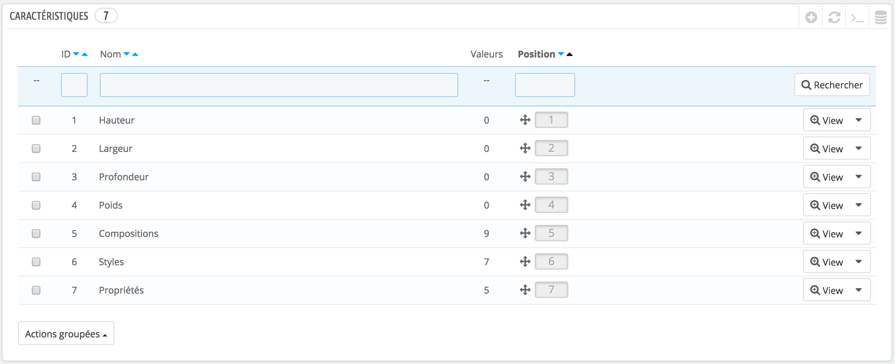
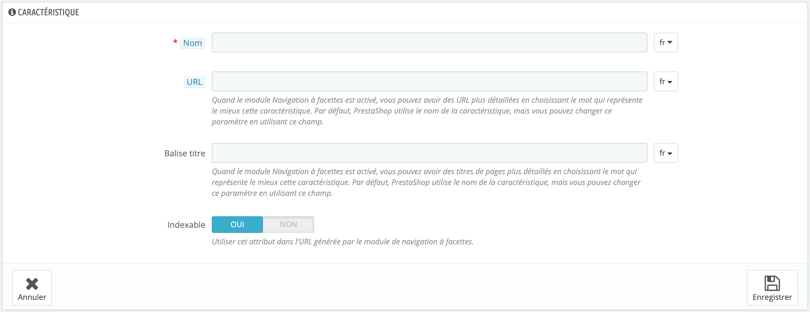

# Gérer les caractéristiques de vos produits

Cette page permet de définir les caractéristiques intrinsèques d'un produit : elles restent les mêmes tout au long des déclinaisons du produit. Vous devriez voir les caractéristiques de la même manière que vous voyez les attributs, avec la différence notable que vous ne pouvez pas créer de déclinaisons à partir des caractéristiques.

La différence entre un attribut et une caractéristique dépend du produit lui-même. Certains produits peuvent partager la même propriété, qui pour un serait un attribut servant à construire des déclinaisons du produit, pour l'autre serait une simple caractéristique immuable. Par exemple, un client peut acheter une déclinaison d'iPad basée sur ses attributs \(couleur, espace disque\) mais pas ses caractéristiques \(poids, taille\).

De la même manière, la même boutique pourrait vendre des déclinaisons basées sur ses attributs \(couleur, taille, genre\) mais pas ses caractéristiques \(poids\). Dans votre boutique, les caractéristiques seront affichées dans un tableau de la fiche produit, pour donner plus d'informations ; alors que les attributs permettront de choisir entre plusieurs déclinaisons.

Les caractéristiques sont configurées par produit, dans la page "Produits" du menu "Catalogue", mais elles doivent d'abord être enregistrées dans votre boutique à l'aide de l'onglet "Caractéristiques" du menu "Attributs & Caractéristiques" dans "Catalogue".

Vous pouvez configurer l'ordre des caractéristiques en les bougeant directement grâce aux flèches dans la colonne "Position". La colonne "Actions" vous donne accès aux actions Modifier, Supprimer et Détails. Vous pouvez aussi cliquer pour afficher les valeurs disponibles pour cette caractéristique et, à partir de là, trier, modifier et supprimer ces valeurs si besoin est.

## Ajouter une caractéristique 

Rien de plus simple : cliquez sur "Ajouter une nouvelle caractéristique" ! Un formulaire apparaît alors, c'est là que vous nommez la caractéristique elle-même : par exemple, un type de casques fournis avec un lecteur de musique.

Donnez un nom à cette nouvelle caractéristique, précisez son URL et définissez sa balise titre. Si vous souhaitez rendre cette caractéristique indexable depuis le module de navigation à facettes, activer cette option. Enregistrez pour revenir à la liste des caractéristiques.

## Ajouter une valeur à une caractéristique 

Cliquez sur "Ajouter une autre valeur". Un nouveau formulaire apparaît, identique à celui qui permet d'ajouter une caractéristique.

Remplissez le formulaire :

* **Caractéristique**. Dans la liste déroulante, sélectionnez l'une des caractéristiques.
* **Valeur**. Donnez une valeur à l'attribut : "5 kg", "27 cm", etc.
* **URL.** Définissez l'URL de la page de cette valeur.
* **Balise titre.** Renseignez aussi le titre de la page.

 Bien joué, vous pouvez maintenant enregistrer la valeur de cette caractéristique... et en ajouter d'autres en cliquant sur "Enregistrer puis ajouter une nouvelle valeur" !

