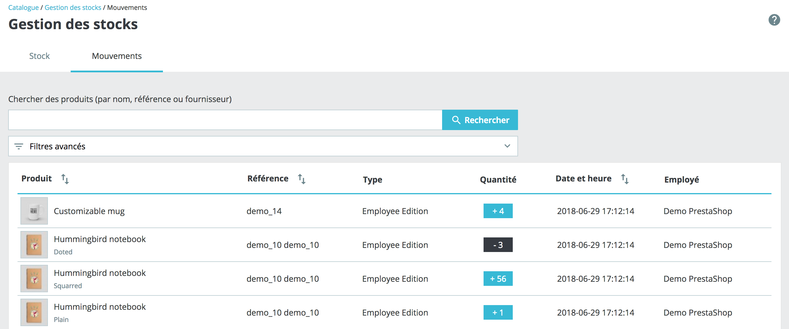
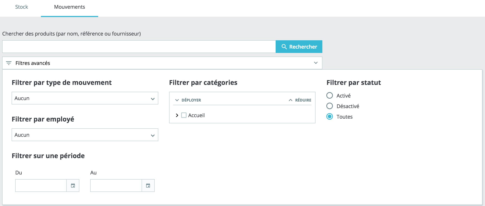

# Mouvements de stock

Ce tableau présente la liste de tous les derniers changements de stock effectués. Elle dresse en quelque sorte l'historique de vos derniers mouvements de stock. Cette liste a juste un caractère informatif, par conséquent elle n'est pas modifiable.

## Vue d'ensemble des mouvements 

### Structure 

L'affichage est le même que celui de la gestion des stocks, sauf qu'ici chaque ligne correspond à un changement dans la quantité physique d'un produit ou d'une combinaison. Le tableau présente les colonnes suivantes :

* La vignette, pour reconnaître rapidement le produit.
* Le nom du produit et, s'il s'agit d'une combinaison, les valeurs de ses attributs.
* La référence du produit. Si une combinaison a sa propre référence, alors elle sera mentionnée à la place de la référence parente.
* Le type du mouvement, qui explique la raison pour laquelle la quantité physique du produit a changé.
* La quantité ajoutée ou supprimée. Ce delta présente le signe + ou - pour une lecture claire et rapide.
* La date et l'heure, soit l'horodatage exact du changement effectué.
* L'employé, soit le nom de la personne responsable du changement.

  
Par défaut, les mouvements de stock s'affichent selon un ordre descendant, c'est-à-dire que le mouvement le plus récent est placé en haut de la liste.

### Les types de mouvements de stock 

Comme sur la version 1.7.2.0, trois types de mouvements se distinguent selon les situations suivantes :

* L'édition manuelle par un employé, lorsque par exemple vous modifiez la quantité d'un produit dans le tableau de gestion des stocks.
* La commande d'un client, lorsqu'une commande passe d'un statut de type "non expédiée" à un autre statut de type "expédiée" \(et vice-versa\). Par exemple, lorsque vous expédiez une commande qui était en cours de traitement, cela crée un mouvement de stock puisque la quantité physique des articles expédiés quitte littéralement l'entrepôt.
* Les produits retournés, lorsque votre stock récupère un article précédemment expédié mais ayant fait l'objet d'un retour.

Dans les deux derniers cas, le type de mouvement renseigné dans le tableau devient un hyperlien qui renvoie vers la commande du client afin d'avoir plus de contexte et d'éviter la vérification supplémentaire de l'horodatage entre les mouvements de stock et le tableau des commandes.

## Options de recherche et de filtre 

### La barre de recherche 

La recherche se fait de la même façon que dans l'onglet "[Stock](stock-fr.md)".

### Les filtres avancés 

Dans l'onglet "Mouvement", les filtres avancés sont :

* un filtre type de mouvement, qui permet de rechercher les mouvements de stock selon les commandes passées par les clients.
* un filtre employé.
* un filtre par période, si vous recherchez des mouvements de stock intervenus sur une période donnée.
* un filtre catégorie, comme dans l'onglet "Stock".
* un filtre statut.

