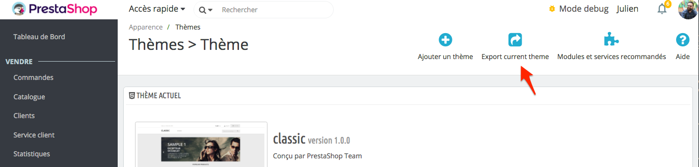

# Distributing your theme

Now that you created an amazing theme, you probably want to release it. The following documentation will walk you through creating a zip and passing Addons validation.

/\*&lt;!\[CDATA\[\*/  
div.rbtoc1595603867569 {padding: 0px;}  
div.rbtoc1595603867569 ul {list-style: disc;margin-left: 0px;}  
div.rbtoc1595603867569 li {margin-left: 0px;padding-left: 0px;}  
  
/\*\]\]&gt;\*/

* [Testing](distributing-your-theme.md#Distributingyourtheme-Testing)
  * [What makes a theme valid](distributing-your-theme.md#Distributingyourtheme-Whatmakesathemevalid)
    * [Required files](distributing-your-theme.md#Distributingyourtheme-Requiredfiles)
    * [Required configuration keys](distributing-your-theme.md#Distributingyourtheme-Requiredconfigurationkeys)
  * [How to use PrestaShop Automated Test Suite](distributing-your-theme.md#Distributingyourtheme-HowtousePrestaShopAutomatedTestSuite)
  * [Add a new test](distributing-your-theme.md#Distributingyourtheme-Addanewtest)
* [Creating a valid zip file](distributing-your-theme.md#Distributingyourtheme-Creatingavalidzipfile)
  * [What is exported](distributing-your-theme.md#Distributingyourtheme-Whatisexported)
* [Distributing on Addons](distributing-your-theme.md#Distributingyourtheme-DistributingonAddons)

## Testing 

But first, you need to test your theme!

### What makes a theme valid 

When you’re trying to select a theme in the back office, PrestaShop will test if your theme is valid. It won’t install if the theme isn’t valid.

A theme is valid if it contains some files and some configuration keys.

#### Required files 

Here is the complete list of required files:

* preview.png
* config/theme.yml
* assets/js/theme.js
* assets/css/theme.css
* templates/\_partials/form-field.tpl
* templates/catalog/product.tpl
* templates/catalog/listing/product-list.tpl
* templates/checkout/cart.tpl
* templates/checkout/checkout.tpl
* templates/cms/category.tpl
* templates/cms/page.tpl
* templates/customer/address.tpl
* templates/customer/addresses.tpl
* templates/customer/guest-tracking.tpl
* templates/customer/guest-login.tpl
* templates/customer/history.tpl
* templates/customer/identity.tpl
* templates/index.tpl
* templates/customer/my-account.tpl
* templates/checkout/order-confirmation.tpl
* templates/customer/order-detail.tpl
* templates/customer/order-follow.tpl
* templates/customer/order-return.tpl
* templates/customer/order-slip.tpl
* templates/errors/404.tpl
* templates/errors/forbidden.tpl
* templates/checkout/cart-empty.tpl
* templates/cms/sitemap.tpl
* templates/cms/stores.tpl
* templates/customer/authentication.tpl
* templates/customer/registration.tpl
* templates/contact.tpl

#### Required configuration keys 

Your configuration file `config/theme.yml` must details some configuration keys.

Here is the list of keys PrestaShop will look for. The dot represent the nesting.

* name
* display\_name
* version
* author.name
* meta.compatibility.from
* meta.available\_layouts
* global\_settings.image\_types.cart\_default
* global\_settings.image\_types.small\_default
* global\_settings.image\_types.medium\_default
* global\_settings.image\_types.large\_default
* global\_settings.image\_types.home\_default
* global\_settings.image\_types.category\_default
* theme\_settings.default\_layout

### How to use PrestaShop Automated Test Suite 

PrestaShop 1.7 comes with an automated test suite used to develop Classic. You should use them to ensure your theme is fully compatible with PrestaShop’s feature.

You need `nodejs`, `npm`, `java` and Chrome installed on your machine.

The test suite is **destructive**. Do not run it in production.

Prepare your store for the tests:

1. `cd tests/Selenium`
2. `npm install`
3. Install PrestaShop, preferably with 2 languages \(though tests should ideally be language and settings agnostic\)
4. Copy `tests/Selenium/settings.dist.js` to `tests/Selenium/settings.js` and customize according to your setup
5. Once PrestaShop is installed, run `php prepare-shop.php`. **WARNING: never do this on a production shop because it will edit existing products without asking for your permission.**

The test suite uses Selenium,

[`webdriver.io`](http://webdriver.io) allows you to perform almost any action a browser would do using a fluent promise-based API. You will need some familiarity with promises to make the most of the tool.

### Add a new test 

If you want to create a custom test, there are a few things you should know. Tests are contained in the `specs` subfolder.

Until we can do more documentation, please have a look at the existing tests and at the [WebDriver.io API](http://webdriver.io/api.html).

If you need to add general purpose helper functions for your tests, they should go in `commands/init.js`.

If you need fixtures for your tests, please use the ones from the default installation or provide a script that installs them.

Do not hard-code things such as product ids in your tests: instead abstract them behind a name and put them in the `fixtures.js` file.

## Creating a valid zip file 

There is no longer any theme data in the database with PrestaShop 1.7. Hence a theme is installed as soon as it’s on the disk.

If you want to theme to appears in the back office, it’s simply have to contain a `config/theme.yml` file. This will only display it, if you want to select it as your active theme, it has to be valid.

Once it’s active you can export your theme using the \_”Export current theme”\_ button or use the command from your terminal.

### What is exported 

Exporting your theme using the button or the command line will export the following data:

* All theme files in directory
* Dependencies specified in `theme.yml`
* Theme translations

## Distributing on Addons 

Please note that if you want to sell your theme on the PrestaShop Addons, there are a few rules to follow:

\*\* LIST OF REQUIREMENTS \*\*

* Use Bootstrap 4 alpha 4 – [follow the appropriate doc](https://github.com/twbs/bootstrap/tree/v4.0.0-alpha.4/docs).
* Add your key – [follow the appropriate doc](http://developers.prestashop.com/themes/gettingstarted/theme-yml).

