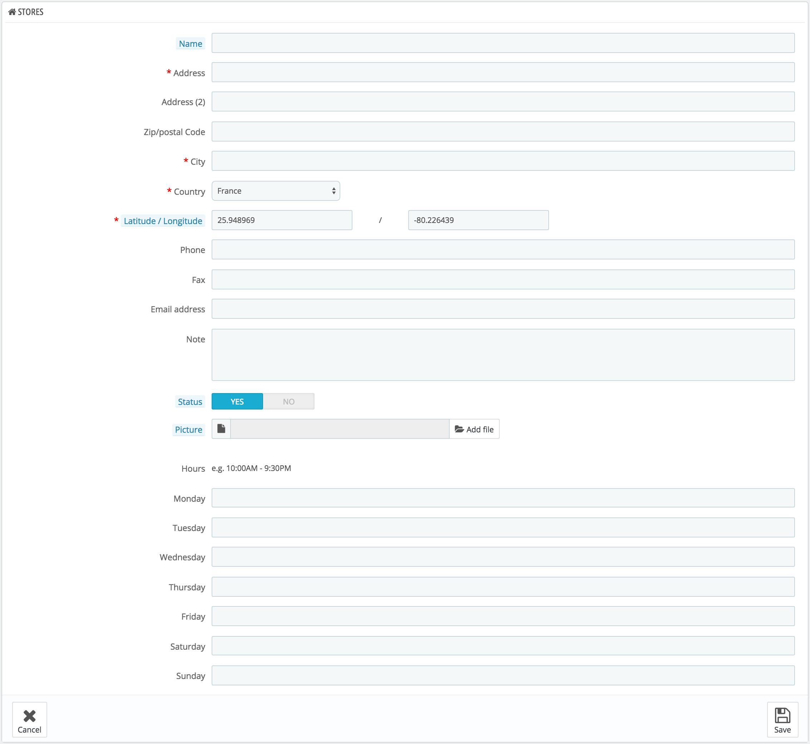
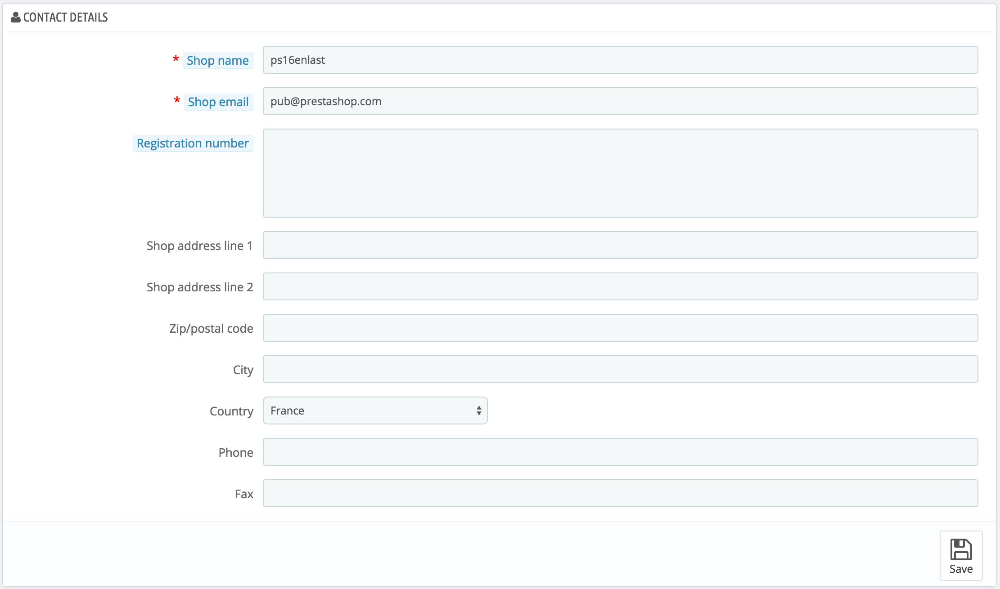

# Stores and Contact Details

## Store Contacts Preferences 

PrestaShop provides a list of your physical store to your customers, with detailed contact information. Obviously, this feature is only useful if you do have physical stores, where customers can come buy products.

Customers can reach the "Stores" page from the footer of your shop.

You cannot disable this feature, but you can make it inaccessible to customers:

* Disable or delete all the stores listed in the "Stores" administration page.
* Disable the link in the footer: in the "Link Widget" administration page, remove the "Stores" link from the "Our company" block.

At this point, the page will still exist and it will still be accessible to search engines. To delete it for good, you should:

* Go to "Traffic &gt; SEO & URLs"
* Find the "stores" page
* Delete it

If some day you want to have the "Stores" page back, you should create a new page in the "SEO & URLs" page, with the following information:

* Page name: Select "stores"
* Page title: "Stores"
* Rewritten URL: "stores"

### Store list 

You can choose how these stores are displayed in the front office. The customer can access them through the "Stores" link \(depending on the theme\)

In your interface, all your stores are listed in a handy list, giving every store's information as well as an indicator telling whether the store is currently active or not – you might for instance want to gather the information for a new store in advance, in order to have its page ready for the launch.

#### Adding a new physical store 

As usual, click "Add new store" to reach the store creation form.

Fill as many of the fields as possible, as they will be displayed to your customers.

One important field is the "Latitude/Longitude" one, as this is what your theme might use to indicate the location of your store. You can use Steve Morse's online tool to get the lat/long coordinates of a given address: [http://stevemorse.org/jcal/latlon.php](http://stevemorse.org/jcal/latlon.php).

Make sure to add a picture of the store front, as this is how your customers will be able to find it once in the street.

Finally, the business hours are an essential part of any physical store, and you should be as precise as possible about them.

## Contact details 

This section enables you to give the main details of your company, rather than those of a specific shop. You should fill all the fields with information on your headquarters, as this is certainly the address customers will use to contact you, or even visit you.

These fields should be carefully filled:

* **Shop name**. The name of your store. Keep it short, as it will be used in all your correspondence and page titles.
* **Shop email**. The official contact address for your business. Use the general contact e-mail address that the customers should see when they receive an e-mail from your shop.
* **Registration number**. Indicate your company's legal registration numbers, which depends on your country's legal system \(Duns number in the USA, SIRET number in France, CNPJ number in Brazil, etc.\). This shows that you are a fully registered business, thus giving a more reassuring opinion of your shop to your potential customers.
* **Shop address line 1** / **Address line 2** / **Postal code/Zip code** / **City** / **State** / **Country**. Use the official contact address of your business. The "State" option only appears when the selected country has states set in your database \(through the "States" page in the "Localization" menu\)
* **Phone**. The official contact phone number for your business. If you'd rather customers not call you, do not put anything in there.
* **Fax**. The official contact fax number for your business.

Do not use a colon \(":"\) in your store's name, as it might prevent some features from working \(for instance, e-mail sending might fail\).

You can replace the colon with a dash if you need to have two sections in the title. For instance, use "MyStore – The best place for items to buy" instead of "MyStore: The best place for items to buy".

