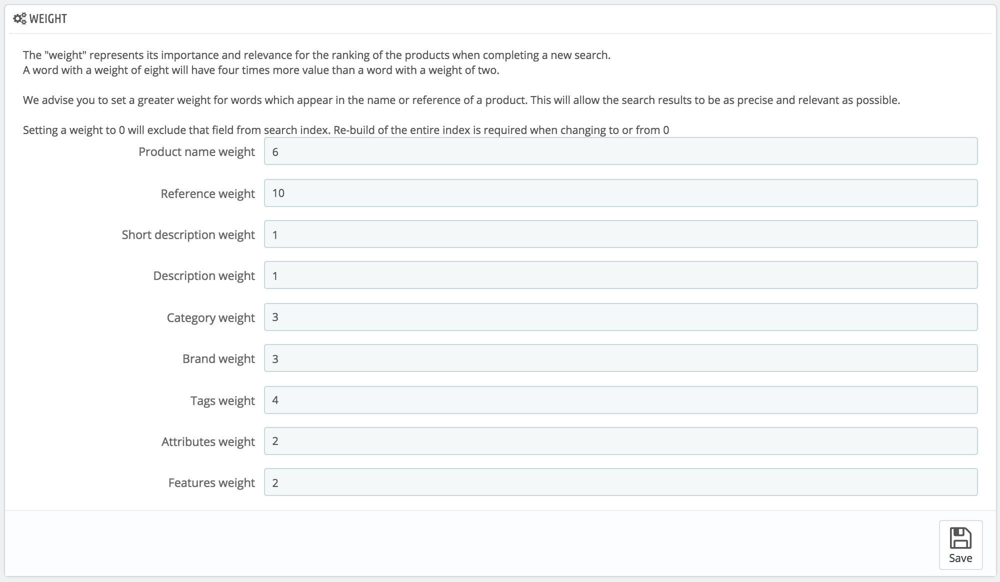

# Search parameters

The "Search" page enables you to configure your shop's search features.

## Aliases list 

When customers make a request using your shop's internal search engine, they may make mistakes in spelling. If PrestaShop does not display the right results, the "alias" feature can address them. You will be able to take words containing spelling errors, and point them to the real products sought by customers.

To create a new useful alias, you should first find the spelling errors most often typed by your users:

1. Go to the "Shop search" tab of the "Stats" page, under the "Stats" menu. You can see the words typed by your customers as well as the most frequent errors.
2. Take the most frequent ones, and add them to your list of aliases, in order to point users to the correct products.
3. Click the "Add new alias" button on the "Search" parameters page.

The creation form is very straightforward: indicate the typo you want corrected, and the correct word it should lead to.

For instance, let's say your visitors frequently type "player" as "palyer" and "plaier". You can create an alias for each of these typos, which will match the word "Player". Your aliases can be used as soon as they are saved.

We also invite you to consult the sections of this guide on product and category meta tags, to better understand how to display products based on words typed by your customers. 

## Indexing 

This section provides information on the number of products that can be searched through your shop's search function, and compares it to the number of products present in your catalog.   
If the values do not match, you must click the "Add missing products to the index" link. Only the new products will be indexed.  
If you have made several changes to already indexed products, you might prefer to choose to re-build the whole index. The "Re-build entire index" process takes more time, but it is more thorough.

PrestaShop also gives you the URL to let you create a cron task for regular re-building of the index. If you do not know about cron and crontab, ask your web host about it.

Finally, the "Indexing" option enables you to have a product be indexed as soon as it is created/modified, thus rending the above links and cron link useless.

## Search options 

This section enables you to configure the behavior of your shop's search function:

* **Search within word**. This option improves search by allowing you to make queries that do not only match the start of the search word; for instance, "lou" for "blouse".
* **Search exact end match**. With this option you can give results that will match exactly the end of the search word. For instance, if you search "book", you will see "notebook", but not "bookcase".
* **Minimum word length**. You can choose the minimum size at which a word may be registered in the search index and found by your customers. This feature allows you to eliminate short words in the search, such as prepositions or articles \(the, and, of, etc.\).
* **Blacklisted words**. You can choose the terms that must not be found by your visitors. Enter them directly into the field, separated by "\|" \("pipe" character, not lowercase L\). By default, PrestaShop fills the list with common short words.

## Weight 

PrestaShop enables you to prioritize certain data when a search is performed on your shop.

As indicated in the section, the search "weight" of a product represents its importance and relevance for the ranking of the products when customers try a new search. An item with a weight of 8 will have 4 times more value than an item with a weight of 2.

For instance, by default "Product Name Weight" is at 6, "Tags weight" is at 4, and both "Short description weight" and "Description weight" are at 1. This means a product with "ipod" in its name will appear higher in the search results than another product which has "ipod" only in its tags. Meanwhile, a product which only has "ipod" in any of its description will have the lowest rank in the search results.

You have many factors that you can assign a weight to: short description, category, tags, attributes, etc. You will find that the display order of results can be reversed because you changed the weight of the various fields. Fine-tuning these settings will be more visible on a large catalog with many references.

Once your changes are saved, they take effect immediately.

