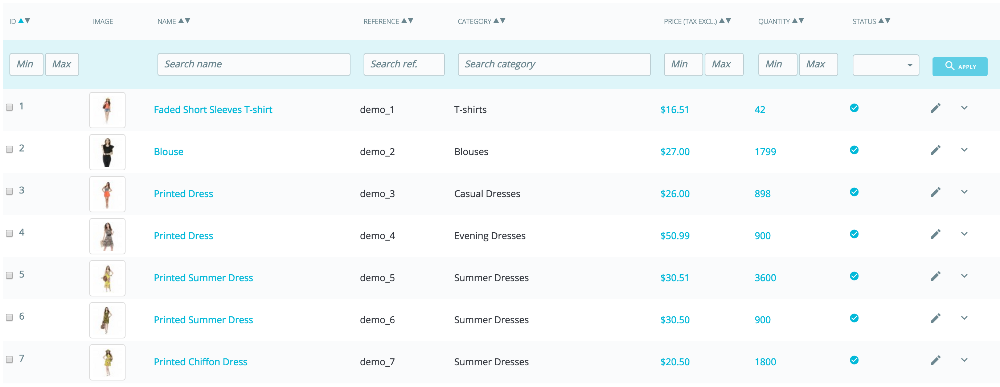

# First steps with PrestaShop 1.7

## First steps with PrestaShop 1.7 

You must spend a good amount of time making sure every part of your future online shop is properly set up, secured, validated and ready for business.

While PrestaShop makes it easy for you to install it and build your business online, it cannot possibly be a 5-seconds work: you are dealing with products, customers, carriers, and most importantly with real actual money that will be flowing from your customers to your bank account. We dare say you want to make sure nothing fails in the process of validating an order, having the products be found in your storage location, then be packaged, and shipped to your customers without a single glitch, or even without anything unpredicted happening without your knowledge.

PrestaShop is a very complete tool, and the number of possibilities can feel overwhelming. This chapter will therefore lead you through some basic actions to perform in order to set up your shop before the big launch. A lot can and must be done before you launch your shop, but these steps are the essential configuration steps of any shop.

### Deactivate your shop 

We will consider that you are still within the first hour following your installation of PrestaShop, in a single-shop instance.

Deactivating your shop means making sure that no one can access it while you are busy making changes, creating products, settings prices and taxes, installing payment modules and a new theme, setting carriers... This is called "putting your shop in maintenance mode".

In your back office, go the "Shop Parameters / General" page. Maintenance options are on the second tab and it features three simple settings:

* **Enable Shop**. Simply set it to "No", and your front-end will display the maintenance page to your visitors, which simply states that your shop will soon be back online.
* **Maintenance IP**. This is where you must put your own IP address, so that you can still get access to your front page, and browse your shop as if it was available to all. This is a must-do every time you put your shop in maintenance mode, as you will always need to browse your front-end so as to make sure everything is in place as intended.  Simply click on the "Add my IP" button. You can add more IP addresses by separating them with commas.
* **Custom maintenance text**. New in 1.7. You can now display a message of your own on the maintenance page, to inform your visitors when the site will be back for instance.  

If you have already decided what your theme and products are, you can simply put your shop in Catalog mode. This means that customers can browse your shop, but no price will be displayed, and they won't be able to add anything to their cart until you disable the Catalog mode.

You can activate the Catalog mode by going to the "Shop Parameters / Products Settings" page, where it is the first option.

### Delete the content of the default shop 

The default installation features a handful of products – mainly women's clothing. Their only use is to help you explore the organization of a real store. After you've learned the intricacies of the ties between products, categories, orders and customers, you should delete all these items in order to start your shop with a clean slate.

You must therefore delete all the default data, which means:

* products and their...
  * categories
  * attributes
  * features
  * manufacturers
  * suppliers
  * image mappings
  * tags
* orders
  * order messages
* customers
  * customers shopping carts
* carriers
  * price ranges
  * weight ranges
* contact & stores \(delete or adapt to your business' needs\)
* Pages \(delete or adapt to your business' needs\)

This would mean browsing through the many various screens of the back office and deleting content one page after the other, but there is much easier way:

1. Go to the "Modules &gt; Modules & Services" page.
2. Find the "Database Cleaner" module and click its "Install" button.
3. Click its "Configure" button.
4. Read and accept the warning, then click the "Delete Catalog" button: it will delete all your products and their attributes, manufacturers, etc.
5. Read and accept the warning, then click the "Delete Orders & Customers" button: it will delete all your customers and their orders, carts, etc.
6. Click the "Check & fix" button to refine your database integrity constraints.
7. Click the "Clean & optimize" button to reorganizes the physical storage of table data and associated index data, to reduce storage space and improve I/O efficiency when accessing the tables.

**THERE IS NO WAY BACK**. Be sure to only click these buttons if you do intend to wipe your database from its default content.

### Configure your shop's information 

Now that you have a clean shop, you can start making it your own, and that implies setting everything up to your likings, starting with your personal information and your preferences.

#### The shop's basic settings 

You should pay attention to the following settings, most of which are important because they are displayed in the front office, and therefore in plain sight of your customers.

Some of these settings require you to configure a module instead of changing one of PrestaShop's preferences.

Configuring a module is easy:

1. Go to the "Installed Modules" page under the "Modules" menu.
2. Type the name of the module \(or part of it\) in the module search box. It should display results as you type.
3. When the module is found, click its "Configure" button, and follow the instructions.

For each module presented here, you should read their documentation for more information.

<table>
  <thead>
    <tr>
      <th style="text-align:left">Setting</th>
      <th style="text-align:left">Description</th>
      <th style="text-align:left">Where to find it</th>
    </tr>
  </thead>
  <tbody>
    <tr>
      <td style="text-align:left">Shop name</td>
      <td style="text-align:left">Defines your brand, most notably on search engines (Google, Yahoo!, Bing...).</td>
      <td
      style="text-align:left">&quot;Shop Parameters&quot; menu, &quot;Contact&quot; page, &quot;Stores&quot;
        tab, then in the &quot;Contact details&quot; section, edit the &quot;Shop
        name&quot; option.</td>
    </tr>
    <tr>
      <td style="text-align:left">Shop logo</td>
      <td style="text-align:left">Defines your brand visually. The default logo says &quot;Classic&quot;,
        which is the name of the default theme.
         Displayed at the top left of every page of your store, as well as in your
        invoices and other automatic e-mails.</td>
      <td style="text-align:left">&quot;Design&quot; menu, &quot;Theme &amp; Logo&quot; page, &quot;Your
        current theme&quot; section, then change the various default images to
        your logo.</td>
    </tr>
    <tr>
      <td style="text-align:left">Default shop currency</td>
      <td style="text-align:left">The currency in which you want to set the default price for your products.</td>
      <td
      style="text-align:left">&quot;International&quot; menu, &quot;Localization&quot; page, &quot;Configuration&quot;
        section.
         If the currency is not available, you must import a localization pack
        for its country first: use the &quot;Import a localization pack&quot; tool
        from the same page.</td>
    </tr>
    <tr>
      <td style="text-align:left">Shop information</td>
      <td style="text-align:left">Several blocks presenting the phone number for your shop, your contact
        address and the email for your shop. These are displayed at various places
        in the front-offices.</td>
      <td style="text-align:left">
        
The information comes from &quot;Shop Parameters&quot; menu, &quot;Contact&quot;
          page, &quot;Stores&quot; tab, then in the &quot;Contact details&quot; section.

        
To disable it, refer to the &quot;Contact information&quot; module.

      </td>
    </tr>
    <tr>
      <td style="text-align:left">Image slider</td>
      <td style="text-align:left">The slider presents several images, scrolling one after the other. It
        is a strong visual signature for your store and products.
         Usually placed front and center of the homepage</td>
      <td style="text-align:left">&quot;Image slider&quot; module.</td>
    </tr>
    <tr>
      <td style="text-align:left">Pages</td>
      <td style="text-align:left">The content of static pages, such as &quot;About Us&quot;, &quot;Delivery&quot;,
        &quot;Legal Notice&quot;, &quot;Terms and Conditions&quot;, and &quot;Secure
        Payment&quot;. Some of them have default content, which you should adapt
        to your business; some others are empty, and you should paste your own
        text.
         Displayed in the &quot;Information&quot; section of the footer.</td>
      <td
      style="text-align:left">&quot;Design&quot; menu, &quot;pages&quot; page, then edit and create
        pages at will.</td>
    </tr>
    <tr>
      <td style="text-align:left">Social networks</td>
      <td style="text-align:left">A block presenting several icons to follow your company on social media.
        It won&apos;t display by default, so make sure you enter your social media
        links on the module.
         When active, displays in the footer, right column.</td>
      <td style="text-align:left">&quot;Social media follow links&quot; module.</td>
    </tr>
    <tr>
      <td style="text-align:left">Social media sharing</td>
      <td style="text-align:left">On each product page, 4 buttons to share the page&apos;s URL on social
        media: Facebook, Twitter, Google + and Pinterest.</td>
      <td style="text-align:left">&quot;Social media share buttons&quot; module.</td>
    </tr>
    <tr>
      <td style="text-align:left">Top menu</td>
      <td style="text-align:left">The top of the default theme uses a top menu to indicate categories that
        the visitor can go to, as well as links to other locations.</td>
      <td style="text-align:left">&quot;Main menu&quot; module.</td>
    </tr>
    <tr>
      <td style="text-align:left">Reassurance</td>
      <td style="text-align:left">On the product page, a block allows you to display some reassurance details.
        Use it to give some details about your return policy (&quot;Free returns!&quot;),
        your security policy (&quot;Secured payments&quot;), etc., so that visitors
        will feel it&apos;s safe to order from your shop.</td>
      <td style="text-align:left">&quot;Customer reassurance&quot; module.</td>
    </tr>
    <tr>
      <td style="text-align:left">Homepage content</td>
      <td style="text-align:left">The default theme contains a lot of demo content: texts, images, links,
        etc. If you intend on using that theme for your own store instead of buying
        your theme, you should make sure to remove all the default content first.</td>
      <td
      style="text-align:left">
        
&quot;Banner&quot; module: change the image at the bottom of the home
          page.

        
&quot;Custom text blocks&quot; module: display your own messages at the
          bottom of the home page, below the banner.

        
Other modules available in &quot;Installed Modules&quot;, &quot;Theme
          modules&quot; section will help you define the various settings for your
          front office, make sure you check them all!

        </td>
    </tr>
    <tr>
      <td style="text-align:left">Legal compliance</td>
      <td style="text-align:left">Some countries require you to give specific information to your customers,
        regarding your various policies. The &quot;Legal compliance&quot; module
        is here to help.</td>
      <td style="text-align:left">Please read the &quot;<a href="http://doc.prestashop.com/display/PS17/Complying+with+the+European+legislation">Complying with the European legislation</a>&quot;
        page to know more about the changes you should make.</td>
    </tr>
  </tbody>
</table>

These are the most visible default settings on your front-end – at least with the default theme.  
The "Where to find it" column enables you to see where you can find the interface to change these aspects of your store. This user guide will provide you with more details for each interface.

#### Shop languages 

PrestaShop is able to work with many languages, both in the front office and the back office. As soon as more than one language is enabled in your back office, each back office text-field is accompanied with a language code selector, which indicates the current language, and which you can click in order to choose another language in which to write that field's content.

The product page is functioning a bit differently. You won't find a language selector for each text field, but rather a general language selector at the top of the page. Once you've selected a language you can then change the all the contents in this language. Make sure you're editing the right one!

By default, PrestaShop is installed with two languages: the one used when installing the software, and the one attached to the default country at installation \(if different\). To manage the currently installed languages, go to the "Localization / Languages" page from the "International" menu. It presents you with a table of the available languages.

The currently enabled language\(s\) have a green check mark, while the others have a red cross. Click on a checkmark to disable the selected language; click on a cross to enable it back.

You can install and enable many languages if you think your shop needs them, but be aware that you will have to translate your content for all of the enabled languages: product names, descriptions, tags, category names and descriptions, static content \(pages\), module settings, etc.

You can easily import many more languages in the "International / Translation" page \("Add/update a language\), and then enable them in the "Localization / Languages" page.

#### Employees information 

Should you have people helping you with your shop \(whether they are your family, your friends, or paid employees\), you should make sure to create an employee account for each of them – if only to know who has performed which recent action. The other advantage is that you can give them specific profiles and specific access rights to the administration pages: for instance, you might not want everyone to have access to your statistics, your invoices or your payment settings.  
You can create as many profiles as needed.

To create a new employee account, go to the "Advanced Parameters" menu, "Team" page, and click the "Add new employee" button. Give it a name, such as "Martin Doe" or "Shipping handler", and save.   
An account can be used for as many people as needed – but we do advise you to create one for each helping person.

Now that you have a proper account for this employee, you should give that account specific permissions, tailored to the employee's tasks. By default, a new profile cannot do much. It is up to you to set exactly the parts of your shop to which that profile should have access. It can be a tedious task, but it is an important one.  
To assign permissions to an employee account, you must use the "Profile" option in the account creation page: this menu lets you pick the account's profile \(SuperAdmin, translator, etc.\)

You can edit these permissions this way: go to the "Permissions" tab, and select the profile you want to change. A long list of permissions appears: edit them at will. Your changes are saved automatically.

### Configure your payment methods 

Your shop is meant to earn money, and this can only become a reality if you use at least one payment module. Several modules are already available in the default install, which you can install and configure \(from the "Installed Modules" page under the "Modules" menu, in the "Payments & Gateways" category\), and create restrictions for them \(in the "Preference" page under the "Payment" menu\). Many payment modules require you to first set up an account on the service they were built for.

You can also install other payment modules, downloaded from the Addons marketplace: [http://addons.prestashop.com/en/4-payments-gateways-prestashop-modules](http://addons.prestashop.com/en/4-payments-gateways-prestashop-modules)

Check and bank wire are the only two payment methods which are enabled by default. If you choose to keep them, you **need** to configure them with your information: check order and address, account owner, bank details \(IBAN, BIC, etc.\).

These payment methods are configured through the "Wire payment" and "Payments by check" modules, which you can find in the "Installed modules" page.

### Configure carriers and shipment 

Products sold on your shop must be shipped to your customers – unless you only sell downloadable products, in which case the "Shipping" menu will be of little use to you.

Whether you are sending your products yourself by regular post office mail, or you have set up a contract with a carrier, you should set this information within PrestaShop.

See the "Managing Shipping" chapter of this guide in order to learn about shipping and carriers.

**Merchandise return is not enabled by default**. If you want to allow your customers to return products and get a refund or a voucher, you can do it in the "Merchandise return \(RMA\) options" of the "Merchandise returns" page, under the "Customer service" menu.  
Merchandise returns are explained in the "Managing the Customer Service" chapter of this guide.

### Choose your theme 

Your shop should have its own theme in order to have a distinctive style, and therefore be more recognizable, separating it from the numerous other online shops.

There are many themes to choose from on the PrestaShop Addons marketplace: [http://addons.prestashop.com/en/3-templates-prestashop](http://addons.prestashop.com/en/3-templates-prestashop).

You can also choose to create your own theme, or have it created for you by a developer. Refer to the PrestaShop Designer Guide for help.

Once your theme is installed, you should explore it fully in order to know it by heart and be able to help customers out of a situation. Read its documentation carefully.

You can and should customize some of the theme's aspects, most notably its logo in various situations \(header, mail, invoice, etc.\). This is done using the "Theme & Logo" page, which you can find under the "Design" menu.

### Choose your modules 

PrestaShop comes bundled with more than a hundred modules. These are very varied: analytics, front office features, payment, shipping... You should explore the available modules in full, in order to know which ones you might want to enable, and which you'd rather keep disabled.

You can also find many other modules on the Addons marketplace: [http://addons.prestashop.com/en/2-modules-prestashop](http://addons.prestashop.com/en/2-modules-prestashop)

Every time you activate and configure a module, make sure that it does work well within the confines of your theme, in case its features impact your shop's front-end.

### Create your products and product categories 

This is described in details in the "Managing Products" and "Managing Categories" chapters.

### Create your static content 

If you haven't done this already, you should take the time to write the content for the various static pages which are either already available in your PrestaShop installation, or ones that you feel are needed.

Some pages already exist, but their content should really be triple-checked, as they can have a lot of impact on your shop's legal status, among other things.

The default pages are "About Us", "Delivery", "Legal Notice", "Terms and Conditions of use", and "Secure Payment". Some of them have default content, which you should update; some others are empty, and you should paste your own text.  
To edit these pages, go to the "Design" menu, click the "Pages" page, then choose the page you want to edit, or create new ones.

You can create as many pages as you feel are necessary.

### Build your top menu 

Now that you have product categories and static pages, you should arrange them in a logical and compelling way in the top menu.

This is done using the "Main menu" module: go to the "Installed Modules" tab of the "Modules" page, type "menu" in the module search form, and you should find the module. Enable it if it is disabled, then configure it: remove the pages or categories you deem unnecessary, add other pages, and move the content around, until you are satisfied with your menu's hierarchy.

### Activate your shop 

Now that all is set and done, you can finally open your shop to the public.

Go the "Shop Parameters / General" page, and change the two options in the "Maintenance" tab:

* **Enable Shop**: set it back to "Yes".
* **Maintenance IP**: remove your IP from the list. This is optional: your shop will still work if you leave the field as it is.

Your shop should now be fully ready to receive its first visitors... and take its first orders!

