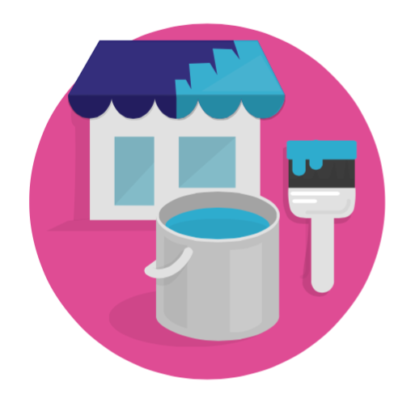

# Improving your shop

As your shop and your business evolve, you will want to add new functionalities or explore new markets. This section is all about customizing your shop: shaping an online shop that matches your current business, and scaling it with new modules, new countries and languages, payment methods or carriers, as time goes by.

This chapter contains the following sections:

* [Managing your Modules](managing-your-modules/)
* [Customizing your store design](customizing-your-store-design/)
* [Managing Shipping](managing-shipping/)
* [Managing Payments](managing-payments/)
* [Going International](going-international/)

