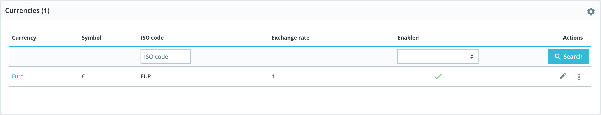
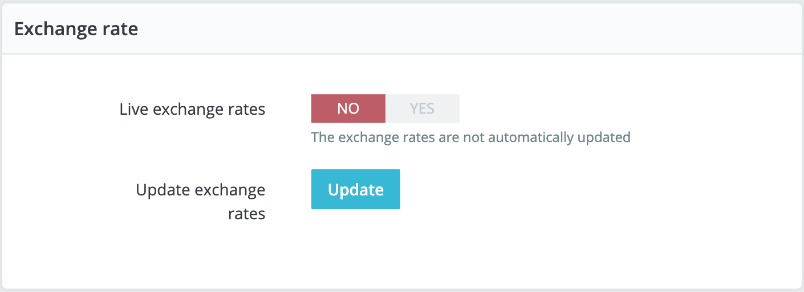

# Currencies

PrestaShop can accept a large number of currencies. By default, there is only one standard currency: the one for your country. However, you can add and configure new currencies depending on your customers' needs. Indeed, customers will appreciate the ability to display your shop's prices in their country's currency.

This page is very simple yet essential, as relate to your currencies exchange rates \(or "conversion rates"\). To quote Wikipedia, "_in finance, an exchange rate between two currencies is the rate at which one currency will be exchanged for another. It is also regarded as the value of one country’s currency in terms of another currency_". Rates change daily, sometimes drastically depending on current events, and your shop should always be updated to the latest values.

In order to change the default currency, you must go to the "Localization" page of the "Localization" menu and use the "Default currency" option from the "Configuration" section.  
If the currency you want to use is not available in this option, you must import the currency from one of the countries which use it, using the "Import a localization pack" section of the "Localization" page.

## Updating the currency rates 

You can update the currency rate by clicking on the "Update" button in the "Exchange rate" frame. This will download the update file from the [PrestaShop](http://PrestaShop.com) website's servers, using PrestaShop web-service.

  
Note that the rates are provided as-is: the PrestaShop team does pay attention to have correct rates in these files, but might slightly differ from the actual ones, if only because these rates can fluctuate greatly in a short time.

## Adding a new currency 

The easiest way to add a country's currency is to import its localization package. This is done in the "Localization" page, under the "International" menu. Once imported, you must go to the "Currencies" page to enable it. You might need to add a currency not featured in any the localization packages. In that case, you can use the creation form. Click on "Add new currency", and a new page opens:

* **Currency**. The name of the currency, preferably in English, so that as many customers as possible can read it.
* **Exchange rate**. This rate is to be defined according to your shop's default currency. For example, if the default currency is the Euro and this currency is dollars, type "1.31", since 1€ usually is worth $1.31 \(at the time of this writing\). Use the converter here for help: [http://www.xe.com/ucc/](http://www.xe.com/ucc/). If you don't know the exchange rate, leave it as 1, and when the currency is created, update the exchange rates by clicking "Update exchange rates".
* **Associated shop**. You can make a currency available for specific shops only, for example a local store.
* **Status**. Any currency can be disabled at any time, both from its own edit page, and the currencies table on the "Currencies" page. When you create a new currency, it is disabled by default. Toggle the "Status" option to enable it. The status will change to "This currency is enabled".  

