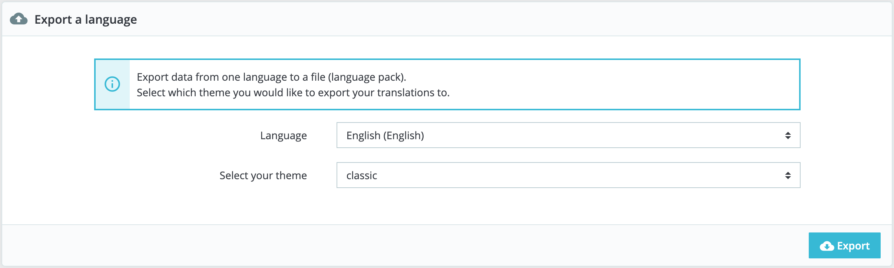
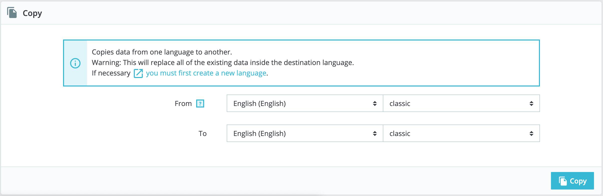

# Translations

PrestaShop provides you with a full translation tool for your shop. This helps you add and edit your pages translations. This way, you are the master of your shop and can handle your translated strings, or expressions, without having to wait for official translators to publish their corrections. Indeed, PrestaShop comes in many languages, and both the administration panel and the default theme are already translated in more than 25 languages, but some languages are not complete yet.

Even if you do not want to correct the translators' work, you might want to change the wording they chose to use \(less formal, less wordy, etc.\), and customize the various available text, thus tailoring your website to your audience; for instance, a hip-hop clothing shop might be better off using different expressions from that of a luxury watches shop.

The process of adapting a program to foreign languages is called _internationalization and localization_, or i18n and L10n for short.

Internationalization is the first step, where developers choose a mechanism for the translation of the software. All the strings of the software are then converted to make use of this mechanism. Localization is the second step, where bi- or multi-lingual users of the software actually translate the original strings into their own language. Localization may also include providing local data in order to further improve the software for local users. You can learn more about i18n and L10n on [Wikipedia](http://en.wikipedia.org/wiki/Internationalization_and_localization).

The PrestaShop team has chosen to use its own built-in translation tool, so that anyone with a PrestaShop installation may customize their shop to their needs. All available translations are done by our community through an online tool, Crowdin, located at [https://crowdin.net/project/prestashop-official](https://crowdin.net/project/prestashop-official). Join and help us so that PrestaShop is fully translated in your language too!

Video - 5 Questions to ask before translating your online store

## Modifying a translation 

The most important tool of the "Translation" page is in the "Modify translations" section. This is where you can choose to add a translation, and completely customize each and every sentence if you wish so.

Select the part of the current translation that you wish to edit:

* **Back office translations**. The text that is visible to you and your team from your store's administration panel.
* **Theme translations**. The text visible to your customers when browsing your store.
* **Installed modules translations**. The content from the modules. Note that modules which are available but not installed will not appear in the tool.
* **E-mail translations**. The terms used in the default email templates.
* **Other translations**. This category is meant to disappear in a coming version. It contains expressions that haven't been identified as being from the theme or the back office yet.   

If you are looking for a specific expression either in "Back office", "Theme" or "Email templates" sections, but you are unable to find it, it might be under the "Other translations" section.

Some categories have a second drop-down list, which lists the available themes. PrestaShop themes have their own strings but can also have their own modules and email templates. The drop-down list enables you to choose which theme you want to work with. Once your selection done, choose the language code of the language in which you wish to edit that category of translation and click on "Modify". A new page opens where you can manage translations. It is organized into several sections.

## Searching for an expression 

At the top of the page, there is a search bar to help you find a specific word, sentence or expression that you could want to modify or translate. On the right, it indicates the number of expressions available in this section, and how many are not translated yet, in the language you selected.

Enter the searched expression and click "Search" to find it. The expressions matching your search will be displayed below, with a notification indicating how many results were found. You can either modify or translate it and click "Save" to save your changes. Clicking "Reset" will replace your custom translation by the official PrestaShop translations: either restore the initial translation if a translation was available or empty the field if no translation was available.

You can browse the tree on the left to find all the sentences matching your search:

## Browsing translations 

The left column is here to help you browse through the various strings available in the category you want to translate or modify. It relies on what we call translation domains: each expression within PrestaShop is assigned a domain, giving translators more context, and making it possible to know where this expression is displayed in PrestaShop, and what it is about.

For the back office and front office section, you will see two main domains, the second being modules. Indeed, modules have content that can either be displayed on the back or the front office, so these expressions will be available when you want to translate the back or front office. Beside each domain, the number of missing expressions is displayed. It helps you know where you should focus is you want to fully translate PrestaShop. To see the expressions for a domain, click its name: you will see all the expressions on the right.

Domains structure

While at first it can seem complicated to browse through translations domains, you will quickly understand how it works and you will easily find your way through the domain tree.

Each section \(back office or theme\) is further divided into functional domains, matching each sections of the back office \(or theme\).

For example, for the back office, the following domains correspond to their matching pages in the interface:

* _AdminCatalog, AdminModules, AdminDesign, AdminShipping, AdminPayment, AdminInternational, AdminShopParam_ and _AdminAdvParameters._
* _AdminOrdersCustomers_ contains the expressions for the “Orders”, “Customers” and “Customer Service” sections from the back office.

These domains can have several sublevels: _Feature_, _Notification_, and _Help_. It means the following:

* _Feature_: everything specific to a functional domain. If you’re in the “Shipping” section, the domain _Admin.Shipping.Feature_ will contain all the expressions displaying in the Shipping menu, that are particular to these pages.
* _Notification_: info, success, warning or error messages specific to the functional domain and the pages it includes.
* _Help_: help text and placeholders.

On the other side, some domains are more generic:

* _AdminNavigation_ is about all the strings from the menu, footer, and header of the back office.
* _AdminActions_ gathers all the call-to-actions, buttons or links that you find on the back office, and that are quite generic \(“Save”, “Add”, “Delete”, etc.\)
* _AdminNotifications_ are all the warning, error or success messages that can appear in the back office. They must be general notifications applying to any part of the software \(e.g. “Settings updated”\).
* _AdminGlobal_ is contains anything which doesn’t fall into the other categories but is still related to the back office, given that it can be found in a lot of occurrences \(“Status”, “Settings”, “Enabled”, etc.\) AND in different parts of the software too. 

The same logic can be applied to the theme translations:

* _ShopTheme_ and its sublevels _\(Catalog, CustomerAccount, Checkout, Actions\)_ are the expressions from the default theme and its main sections
* _ShopForms_ are specific to the various forms you can find on the default theme
* _ShopNotifications_ are the messages showing up on your shop, whether it is error or success messages.

## Modifying translations 

When you open a domain to see all its strings, you can then modify existing translations, or fill out missing ones. Clicking "Save" will logically save your changes. You have one button at the top of the page, and another one at the bottom of the page. Clicking "Reset" will replace your custom translation by the official PrestaShop translations: it either restores the initial translation if a translation was available or empties the field if no translation was available.

Some strings use a special syntax with placeholders, such as `%s`, `%d`, `%1$s`, `%2$d`, etc.

When you find a string with such placeholder, it means that PrestaShop will replace it with an actual dynamic value before displaying the translated string. For instance, in the string "Your order on %s is complete", `%s` will be replaced by the shop's name. Therefore you should keep it in your final translation; for instance, in French, the translation would be "Votre commande sur %s a bien été enregistrée."

Technically, having placeholders prevents strings from being split in parts.

In case of a string with a placeholder, you should make sure that the content of that placeholder will be placed in the correct flow of the sentence, and avoid literal translation.

Numbered placeholders \(`%1$s`, `%2$d`, etc.\) enable translators to rearrange the order of the placeholders in the string while maintaining the information each is replaced with. This way, a French translator could choose to translate "Order \#%1$d from %2$s" into "Commande n°%1$s du %2$s" or "Le %2$s, commande n°%1$s".

### Modules translations 

When you wish to translate a specific module, choose "Installed modules translations", then select the one module you want to edit. It will open a new page with the content from this module, and all its available strings.

  
Depending on the module you are looking at, the interface could be different. Some modules are using a translation system specific to 1.7, while others are still using the former system from 1.6 version. In the end, it doesn't change anything for you, as you will be able to translate your modules just the same.

### Email templates 

Issues with email translation

1.7.6 version has come with a couple of bugs on this part of the back office, due to its rework. But rest assured, they are all addressed and being fixed for PrestaShop 1.7.7. You can have a look at it [here](https://github.com/PrestaShop/PrestaShop/pull/14809) and [there](https://github.com/PrestaShop/PrestaShop/pull/16294)!

The way email templates translations are handled is a bit different from the other translations.

Strings are split into fieldsets, but they are not simple text fields anymore. Each e-mail has two templates: an HTML one, which is styled and colored, and a text one, when is plain and simple. While the plain text one can be edited directly in the text field, the HTML one can only be edited by clicking on the "Edit this e-mail template" button at the bottom of the preview. That click turns the preview into a WYSIWYG text field \(what you see is what you get\), with a complete editor at the top \(based on [TinyMCE](http://www.tinymce.com/)\). In addition to editing the text, you can change the design as you see fit. For instance, you can change the colors in order to adhere to your shop's design.

Note that the e-mail templates feature placeholders, such as `{lastname}` or `{shop_name}`, which PrestaShop replaces with the actual values when sending the e-mail. Make sure to keep them in both your translation.

## Add / Update a language 

PrestaShop translations are available in packs, which combine all the different translation categories into a zip file. Many language packs are available freely for you to download and install, directly from the PrestaShop servers. PrestaShop will take care of downloading the language pack, unpacking it and creating the correct sub-folder in your installation's `/translation` folder.

You can then manage the new language in the "Languages" page of the "Localization" menu.

## Export a Language 

You can create your own language pack using this tool, either as a way of making a backup of your customizations or in order to share your translations with other PrestaShop installation – your own or someone else's.

Simply choose the language and the theme of the translation you wish to export, and click the "Export" button. Note that the pack will contain the theme that your translation is supposed to support.

## Copy 

You can copy the content of one language to another. This is especially useful when you wish to replace a theme's language with the same language from another theme.

Choose the source language and theme, then the destination language and theme, then click the "Copy" button. In most case, the language should remain the same in both drop-down lists.

If there is already a language folder for this language in the destination theme, it will be replaced by the files from the language and theme you are copying. You might prefer to first create a new language for the destination theme before copying the source language to it.

