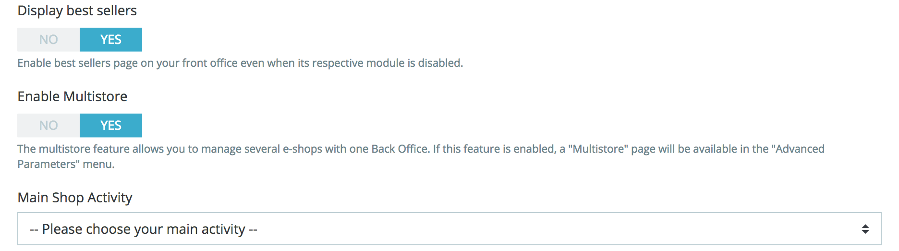

# Managing Multiple Shops

One of the great features of PrestaShop is called "multistore", meaning the ability to manage multiple shops from the same back office.

Thanks to this feature, you can manage many customized shops which share many common elements. For more efficiency, you can even create groups of shops.

## How to decide if you need the multistore feature 

You may find yourself wanting to use the multistore feature, when in fact it is not necessary. For instance, if you want a multilingual shop, or if you need to use more than one currency, or if you would like to have a different graphic template for each category.

Here are two questions that you should ask yourself before deciding to enable the multistore feature:

1. Do you want your shops to have a different price for the same product \(besides special discounts for a client or group of clients\)? **If the answer is 'yes', then you need to use the multistore feature.**
2. When a client buys from one shop, would you want him or her to NOT have access that shop's order history and invoices from the other shop \(even if the client have the same login credentials on both shops\)? **If the answer is 'yes', then you need to use the multistore feature**: the shops will not share their carts and orders, and customers putting items in their cart for shop 1 will not see these items in their cart for shop 2.

If the answer is 'no' to both questions, then the multistore feature is not for you.

## Enabling the multistore feature 

Turning your single-shop PrestaShop installation into a multi-shop one is very simple:

1. Log-in to your shop's administration.
2. Go to the "Shop Parameters" menu and select the "General" page.
3. Find the "Enable multistore" option, select "Yes".
4. Save your changes.

There you go: the multistore feature is now in place, starting with the addition of the "Multistore" page under the "Advanced parameters" menu. This is the page where you will manage the various shops created with this PrestaShop installation.

## Using the multistore feature 

* [The multistore interface](the-multistore-interface.md)
* [Creating a new shop group](creating-a-new-shop-group.md)
* [Creating a new shop](creating-a-new-shop.md)
* [Setting a shop's URL](setting-a-shops-url.md)
* [Sample Usages and Specifics](sample-usages-and-specifics.md)

