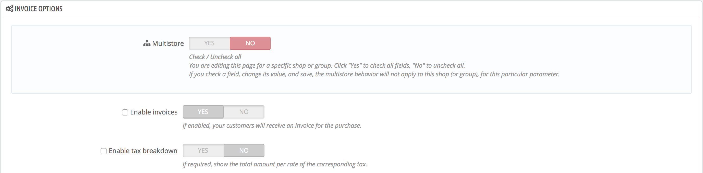

# The multistore interface

## Managing your stores 

The "Multistore" page comprises three mains sections:

* **Multistore tree**. Gives you a bird's eye view of your shop groups, their shops, and even the various URLs tied to a single shop. By default, there is only one shop, in the default group: the main shop.
* **Shop groups** table. Lists the available shop groups. You can edit them by click on the 'Edit' icon on the right.
* **Multistore options**. Lists the available options for the existing shops.
  * **Default shop**. The default shop is the one which will serve a central hub for all the other ones, shares its details with other shops \(products, carriers, etc.\), and is the one that appears when you log in the administration.

## One back office to rule them all 

When the multistore feature is enabled for your PrestaShop installation, many aspects of PrestaShop become customizable on a per-shop or per-shop-group basis.

To help you understand which shop your changes are applied to, PrestaShop adds a drop-down selector at the top of each screen, where you can choose the scope of application of your changes:

* Apply to all of your shops on this installation of PrestaShop.
* Apply to only the shops of the selected shop group.
* Apply to only the selected shop.

This shop selector helps you know on which shop\(s\) you are currently working.

That being said, once the multistore mode is in place, many of the regular settings can only be changed on a global \(all shops\) scale \(international, shop and advanced parameters, administration\) and will, therefore, present the options as disabled in any other selection. Still, you can choose to edit those settings on a more local \(per group shop or even per shop\) scale if it is needed.

Indeed, settings pages will look regular when the shop selector is on "All shops", while in any other selection \(shop group or single shop\) they get additional options:

* A "Yes/No" option at the top of each section of the settings page.
* A check box next to each option.

They both serve the same purpose: letting you enable the options that would otherwise be disabled in the current shop context. You can pick the options that you want to enable, or you can enable all the options of the section by switching the Yes/No option. Once enabled, it is up to you to change the value of each option: clicking the checkbox or switching the Yes/No option does not change any settings, it just allows you to change it in that context.

Nevertheless, some options cannot be edited on a local context: they will display "You can't change the value of this configuration field in the context of this shop".

The following table indicates whether the item can also be customized for a single shop, for a group of shops, or for all shops at once.

<table>
  <thead>
    <tr>
      <th style="text-align:left">Item</th>
      <th style="text-align:left">Per shop</th>
      <th style="text-align:left">Per shop group</th>
      <th style="text-align:left">All shops</th>
    </tr>
  </thead>
  <tbody>
    <tr>
      <td style="text-align:left">Employees</td>
      <td style="text-align:left">X</td>
      <td style="text-align:left">X</td>
      <td style="text-align:left">X</td>
    </tr>
    <tr>
      <td style="text-align:left">Customer groups</td>
      <td style="text-align:left">X</td>
      <td style="text-align:left">X</td>
      <td style="text-align:left">X</td>
    </tr>
    <tr>
      <td style="text-align:left">Products</td>
      <td style="text-align:left">X</td>
      <td style="text-align:left">X</td>
      <td style="text-align:left">X</td>
    </tr>
    <tr>
      <td style="text-align:left">&#x2014; Prices</td>
      <td style="text-align:left">X</td>
      <td style="text-align:left">X</td>
      <td style="text-align:left">X</td>
    </tr>
    <tr>
      <td style="text-align:left">&#x2014; Combinations and prices</td>
      <td style="text-align:left">X</td>
      <td style="text-align:left">X</td>
      <td style="text-align:left">X</td>
    </tr>
    <tr>
      <td style="text-align:left">&#x2014; Languages</td>
      <td style="text-align:left">X</td>
      <td style="text-align:left">X</td>
      <td style="text-align:left">X</td>
    </tr>
    <tr>
      <td style="text-align:left">&#x2014; Multiple images (<b>except for the main image</b>)</td>
      <td style="text-align:left">X</td>
      <td style="text-align:left">X</td>
      <td style="text-align:left">X</td>
    </tr>
    <tr>
      <td style="text-align:left">
        
&#x2014; Available quantity for sale, provided that:

        <ul>
          <li>The &quot;Share quantity available for sale&quot; option is checked for
            the group,</li>
          <li>The group does not share its quantity available for sale outside of the
            group.</li>
        </ul>
      </td>
      <td style="text-align:left">X</td>
      <td style="text-align:left">X</td>
      <td style="text-align:left"></td>
    </tr>
    <tr>
      <td style="text-align:left">&#x2014; All other information (description, tags, friendly URL, etc.)</td>
      <td
      style="text-align:left">X</td>
        <td style="text-align:left">X</td>
        <td style="text-align:left">X</td>
    </tr>
    <tr>
      <td style="text-align:left">Catalog values and attributes</td>
      <td style="text-align:left">X</td>
      <td style="text-align:left">X</td>
      <td style="text-align:left">X</td>
    </tr>
    <tr>
      <td style="text-align:left">Discounts: cart rules</td>
      <td style="text-align:left">X</td>
      <td style="text-align:left"></td>
      <td style="text-align:left"></td>
    </tr>
    <tr>
      <td style="text-align:left">Discounts: catalog price rules</td>
      <td style="text-align:left">X</td>
      <td style="text-align:left"></td>
      <td style="text-align:left"></td>
    </tr>
    <tr>
      <td style="text-align:left">Taxes: tax rules</td>
      <td style="text-align:left">X</td>
      <td style="text-align:left">X</td>
      <td style="text-align:left">X</td>
    </tr>
    <tr>
      <td style="text-align:left">Categories (<b>except for the main image</b>)</td>
      <td style="text-align:left">X</td>
      <td style="text-align:left">X</td>
      <td style="text-align:left">X</td>
    </tr>
    <tr>
      <td style="text-align:left">Carriers</td>
      <td style="text-align:left">X</td>
      <td style="text-align:left">X</td>
      <td style="text-align:left">X</td>
    </tr>
    <tr>
      <td style="text-align:left">Warehouses</td>
      <td style="text-align:left">X</td>
      <td style="text-align:left">X</td>
      <td style="text-align:left">X</td>
    </tr>
    <tr>
      <td style="text-align:left">Advanced stock management</td>
      <td style="text-align:left">X</td>
      <td style="text-align:left"></td>
      <td style="text-align:left"></td>
    </tr>
    <tr>
      <td style="text-align:left">Suppliers</td>
      <td style="text-align:left">X</td>
      <td style="text-align:left">X</td>
      <td style="text-align:left">X</td>
    </tr>
    <tr>
      <td style="text-align:left">Brands</td>
      <td style="text-align:left">X</td>
      <td style="text-align:left">X</td>
      <td style="text-align:left">X</td>
    </tr>
    <tr>
      <td style="text-align:left">CMS pages</td>
      <td style="text-align:left">X</td>
      <td style="text-align:left">X</td>
      <td style="text-align:left">X</td>
    </tr>
    <tr>
      <td style="text-align:left">Contacts</td>
      <td style="text-align:left">X</td>
      <td style="text-align:left">X</td>
      <td style="text-align:left">X</td>
    </tr>
    <tr>
      <td style="text-align:left">Countries
         A country&apos;s status (enabled or disabled) is common to all shop it
        is associated to.</td>
      <td style="text-align:left">X</td>
      <td style="text-align:left">X</td>
      <td style="text-align:left">X</td>
    </tr>
    <tr>
      <td style="text-align:left">Currencies</td>
      <td style="text-align:left">X</td>
      <td style="text-align:left">X</td>
      <td style="text-align:left">X</td>
    </tr>
    <tr>
      <td style="text-align:left">Languages</td>
      <td style="text-align:left">X</td>
      <td style="text-align:left">X</td>
      <td style="text-align:left">X</td>
    </tr>
    <tr>
      <td style="text-align:left">Modules</td>
      <td style="text-align:left">X</td>
      <td style="text-align:left">X</td>
      <td style="text-align:left">X</td>
    </tr>
    <tr>
      <td style="text-align:left">&#x2014; Hooks and exceptions</td>
      <td style="text-align:left">X</td>
      <td style="text-align:left">X</td>
      <td style="text-align:left">X</td>
    </tr>
    <tr>
      <td style="text-align:left">&#x2014; Enabling/disabling</td>
      <td style="text-align:left">X</td>
      <td style="text-align:left">X</td>
      <td style="text-align:left">X</td>
    </tr>
    <tr>
      <td style="text-align:left">&#x2014; Configuration (for instance, PayPal login credentials)</td>
      <td
      style="text-align:left">X</td>
        <td style="text-align:left"></td>
        <td style="text-align:left"></td>
    </tr>
    <tr>
      <td style="text-align:left">Payment modules</td>
      <td style="text-align:left">X</td>
      <td style="text-align:left">X</td>
      <td style="text-align:left">X</td>
    </tr>
    <tr>
      <td style="text-align:left">&#x2014; Per-country restrictions</td>
      <td style="text-align:left">X</td>
      <td style="text-align:left"></td>
      <td style="text-align:left"></td>
    </tr>
    <tr>
      <td style="text-align:left">&#x2014; Per-currency restrictions</td>
      <td style="text-align:left">X</td>
      <td style="text-align:left"></td>
      <td style="text-align:left"></td>
    </tr>
    <tr>
      <td style="text-align:left">&#x2014; Per-customer group restriction</td>
      <td style="text-align:left">X</td>
      <td style="text-align:left"></td>
      <td style="text-align:left"></td>
    </tr>
    <tr>
      <td style="text-align:left">Friendly URLs</td>
      <td style="text-align:left">X</td>
      <td style="text-align:left"></td>
      <td style="text-align:left"></td>
    </tr>
    <tr>
      <td style="text-align:left">Scenes</td>
      <td style="text-align:left">X</td>
      <td style="text-align:left">X</td>
      <td style="text-align:left">X</td>
    </tr>
    <tr>
      <td style="text-align:left">Web service account</td>
      <td style="text-align:left">X</td>
      <td style="text-align:left">X</td>
      <td style="text-align:left">X</td>
    </tr>
    <tr>
      <td style="text-align:left">Homepage image slider</td>
      <td style="text-align:left">X</td>
      <td style="text-align:left"></td>
      <td style="text-align:left"></td>
    </tr>
  </tbody>
</table>

Notes

**Categories**: A product can only appear in a given category of a shop if it has been associated with this category in that shop's context. In other words: if shop A and shop B have the C category in common, you can associate the P product to the C category for the A shop's context, and P will not appear in category C on shop B.

**Carriers**: You can manage the carriers' association on a per-shop basis, a per-shop-group basis or for all shops; but you cannot customize a carrier on a per-shop basis. You must duplicate the carrier if you want to use the same carrier with different price ranges on two shops.

**Warehouses**: While advanced stock management can only be used for a single shop at a time, warehouses can be used with shop groups, and you can simply manage the warehouses in order to have advanced stock management.

For each shop, you can set specific prices for every product, share part of the catalog or the whole of it, change product images, etc.

You can choose to share the customer accounts between your shops, enabling your customers to use the credentials between all shops, and even be transparently signed-in to each.

With advanced stock management, you can do a fine-grained management of the associations between your shops and your warehouses.

